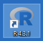
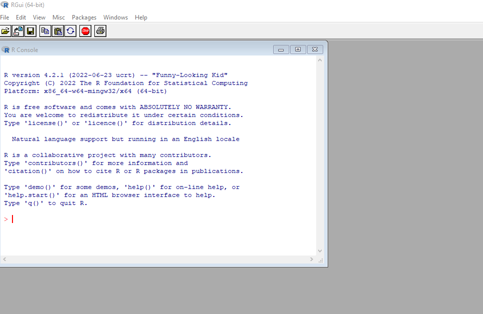
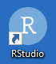
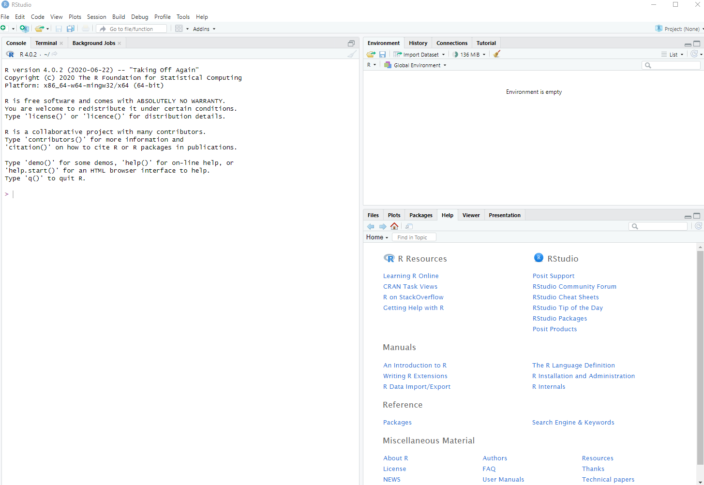
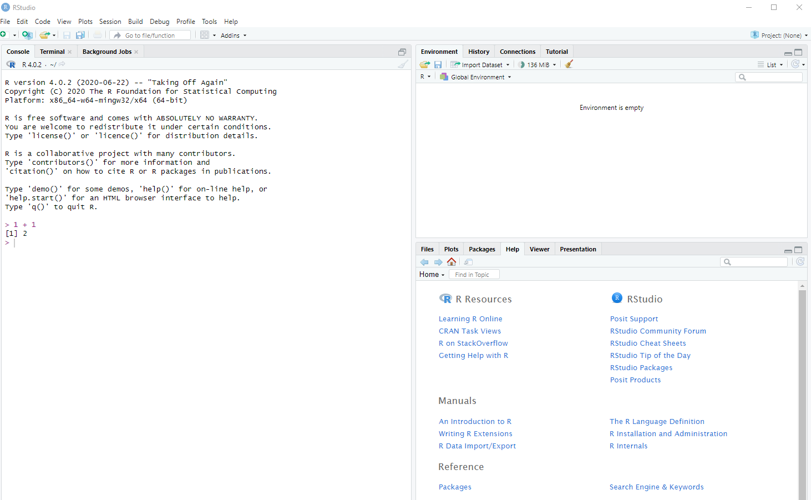
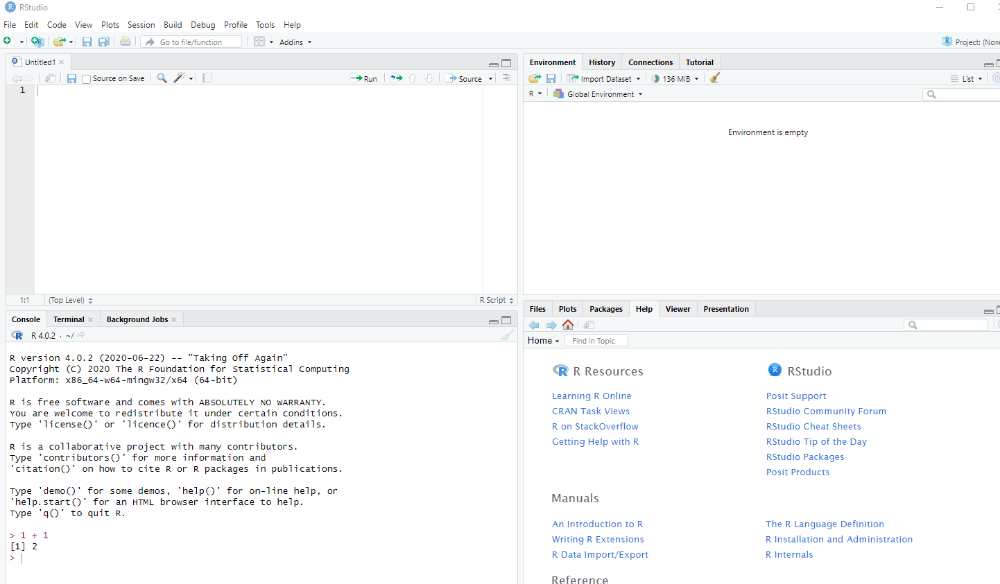
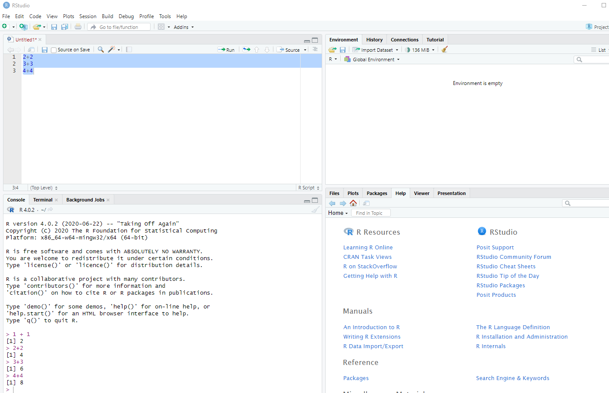
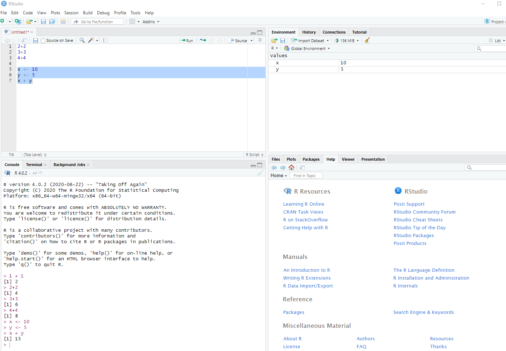
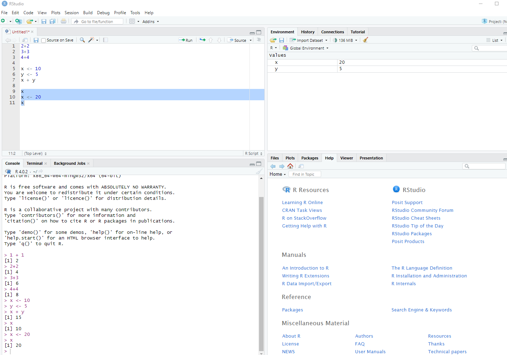

This lesson is a part of the Introduction to R for Air Quality Data Science. The
sections below provide a basic introduction to R, including how to install and 
set up R and RStudio, an overview of R syntax, and how to perform simple operations.

- [What is R](#what-is-r)
- [Why Use a Programming Language](#why-use-a-programming-language)
- [Install R and RStudio](#install-r-and-rstudio)
- [Basic Math](#basic-math)
- [Note on Comments and Code Blocks](#note-on-comments-and-code-blocks)
- [Variables](#variables)
- [Data Types](#data-types)
- [Grouping Data](#grouping-data)
- [Exercises](#exercises)

# What is R

R is a free, open-source computing language. It was originally written by statisticians
for doing statistical analysis in academia. In recent years it has become more widely 
used in many industries for performing a variety of data science tasks such as:

- reading and writing files,
- data transformation,
- graphic visualization,
- geographic mapping,
- and predictive modeling.


# Why Use a Programming Language

R is one of several programming languages that can be used for data science, including
[Python](https://www.python.org/) and [Julia](https://julialang.org/). They each 
have advantages and disadvantages, but they are all powerful tools for air quality
data science. These 
[high-level languages](https://en.wikipedia.org/wiki/High-level_programming_language) 
give you access to modern algorithms for processing
large amounts of data in a few lines of code. 

Many data analysis tasks can be accomplished with spreadsheets and other business 
intelligence (BI) tools such as Looker and Power BI. When should you move beyond
BI tools and use a high-level programming language like R? Below are a few
scenarios where a language like R is more advantageous than a BI tool.

- If you cannot access data easily in your BI tool, R can read just about any
data source
- If you need to save a large number of files, R can automate that process in a
way that BI tools cannot
- Custom data transformations that are not possible in BI tools can be done with R
- Custom data visualizations that are not available in BI tools can be done with R
- Predictive modeling that is not available in BI tools, or only in a rudimentary
way, can be done in R


BI tools are more advantageous if you need enterprise wide dashboards, or tools
that are more easily accessible to a wider audience. If there are few occasions
where you need custom visualizations or transformations, or if you do not
need automation in your work, you may not need to learn a high-level programming
language.


# Install R and RStudio

This section covers the two pieces of software you need to download. R is the core
software that must be installed. RStudio is a nice integrated development environment 
(IDE) that makes it much easier to use R.


To download R, [see this page](https://cran.r-project.org/). You will need to select
the version that is compatible with your operating system (PC or Mac). Accept the 
default options during the installation.

Once you have installed R, you can open the program itself. On PC, if you have
selected the desktop shortcut during installation, the R icon will look like this:



Once opened, the R console looks very plain.



RStudio makes R much more user friendly. It's free and can be downloaded from the 
[Posit website](https://posit.co/download/rstudio-desktop/). Accept the defaults
during installation. It's not necessary to open RStudio to use R, but in these 
sessions we will assume that RStudio is your interface to R.

On a PC, the RStudio desktop icon looks like this:



When you first open RStudio, this is what you see:




The left panel is the console for R. Type `1 + 1` in the console then hit "Enter"
and R will return the answer.





It's a good idea to use a script so you can save your code. Open a new script by 
selecting "File" -> "New File" -> "R Script" and it will appear in the top left 
panel of RStudio.





This is a text document that can be saved (go to "File" -> "Save As"). You can 
type and run more than one line at a time by highlighting and clicking the "Run"
button on the script tool bar.




The bottom right panel can be used to find and open files, view plots, load packages,
and look at help pages. The top right panel gives you information about what 
variables you're working with during your R session.

# Basic Math

Open up a script if you haven't already (“File” -> “New File” -> “R Script”).
Try some math by either typing the lines below or copying and pasting the lines 
into your script

```{r, eval=FALSE}
10 + 5
10 - 5
10 * 5
10 / 5
10 ^ 5
```


Remember, to run the lines, highlight your code and click the "Run" button on 
the toolbar of the script panel. Below is a table of the math operators in
the R language.

|Operator  |Meaning         |Example |
|:--       |:--             |:--     |
|+         |addition	      |2 + 2   |
|-	       |subtraction     |2 - 2   |
|*         |multiplication  |2 * 2   |
|/	       |division	      |2 / 2   |
|^         |exponentiation  |2 ^ 2   |

## Order of operations

R follows the usual order of arithmetical operations and uses parentheses for grouping
operations. Run the two lines of code below and you can see the the different
values that are returned.

```{r, eval=TRUE}
10 - 3 / 5    # R will first do division operation then subtraction
```

```{r, eval=TRUE}
(10 - 3) / 5  # Use parentheses to group and prioritize operations.
```

# Note on Comments and Code Blocks

To write a comment in your script that will not be evaluated, type `#` in front 
of your comment. The text after `#` will not be evaluated. There is no multi-line
commenting in R, so every comment line must begin with the `#` character.

Run all of the code below and see what gets returned in the R console (bottom left
panel in RStudio).

```{r}
# Full line comment
5^2 # partial line comment
```

In the example above and the previous section, you have see the R code and it's
output. The code blocks with output look like this, with `1+1` being the R code
and `## [1] 2` being the output:

```{r}
1+1
```

However, in the R console the code and output would look like this:

```{shell, eval = FALSE}
> 1 + 1
[1] 2
```

The R code in code blocks do not show the `>` part of the console, called the 
prompt, and the output block places two comment marks `##` before the output.
This is to make it possible to copy and paste the text into your R console and run
it without causing an error. 

# Variables

A variable is a letter or combination of alphanumeric characters that is used to 
store data. To create a variable in R, use the less-than character with
the dash to create an arrow symbol pointing left `<-`. Below, the variables `x` and
`y` are created by assigning some numbers to them.

```{r}
x <- 10
y <- 5
x + y
```


In RStudio, you will see the variables we created in the top right panel.




If you’ve already created a variable, you can replace the value with another value.

```{r}
x
```

```{r}
x <- 20
x
```

In the top right panel you can see that the number stored in the variable `x` has 
changed.





There are 3 important rules to remember when creating variable names:

  1. You can't start your variable with a number.
  2. You can't use spaces or special characters ($,%,#,-). Periods `.` and underscores
  `_` are ok.
  3. Capitalization __DOES__ matter in R. That is, R will consider `x` and
  `X` to be different variables.

Try running the following code and you will see that in your global environment 
there are two different objects listed.

```{r}
x <- 5
X <- 5
```

# Data Types

R has three main data types:

Type                        |  Description      |  Examples
----------------------------|-------------------|-----------
character	                  | letters and words |	`"z"`, `"red"`, `"H2O"`
numeric	                    | numbers	          |`1`, `3.14`, `log(10)`
logical                     |	binary            |	`TRUE`, `FALSE`


The `character` type requires single or double quotes. The logical values
`TRUE` and `FALSE` should not be quoted and require full caps.

# Grouping Data

There are several ways to group data to make them easier to work with:

- Vector: stores multiple values of the same type (e.g. all numeric values)
- List: stores multiple values of different types (e.g. some numbers and character values)
- Matrix: a table of values with only one data type
- Data Frame: a table that can have columns with different data types (e.g. a numeric
column and a logical column)

## Vectors

A vector variable can contain only one type of data (numeric, character, or 
logical). We use `c( )` to create vectors.

```{r}
x <- c(1, 2, 3, 4, 5)
x
```

```{r}
fruit <- c("apples", "bananas", "oranges")
fruit
```

If you try to type in text without using quotations marks for character values
(either single or double quotes), then R will throw an error. Try running the code 
below.

```{r, error=TRUE}
fruit <- c(apples, bananas, oranges)
```


R will interpret the text without quotes as the names of variables. Since we don't 
have any variables named `apples`, `bananas`, or `oranges`, R can't find them and
it returns an error.

The members of a vector can be accessed by using single brackets `[ ]`. For example,
to print the 3rd member of the `fruit` vector, you can use the single bracket
with the number 3:

```{r}

fruit[3]

```
We will cover more about accessing members of vectors in the 
[lesson on subsetting](3-Subsetting-Sorting-and-Dates/readme.md).

## Lists

Lists are like vectors but can contain any mix of data types. We use `list( )` 
to create a list variable.

```{r}
x <- list("Benzene", 1.3, TRUE)
x
```

When a list is printed to the console, you will see double brackets `[[ ]]` with
the index number inside. In the example above, the numeric value `1.3` is the 
second value in the list, so it is show below the double bracket `[[2]]`. You can
access the second value by using the double brackets on the list.

```{r}

x[[2]]

```


Lists can also contain vectors and other lists.

```{r}

my_vector <- c(1, 2, 3)

my_list <- list("Benzene", 1.3, TRUE)

y <- list(TRUE, my_vector, my_list)

y

```

In this example, you can use two double brackets to access the value `1.3` by
selecting the 3rd member of the list `y` and the 2nd member of the list
`my_list`:

```{r}

y[[3]][[2]]

```

## Data frames

Data frames are data tables in R. We use `data.frame( )` to create a data frame
of vectors of the same length. In the example below we create three vectors of
the same length and use them to create a data frame.

```{r}
pollutant <- c("Benzene", "Toluene", "Xylenes")
concentration <- c(1.3, 5.5, 6.0)
carcinogen <- c(TRUE, FALSE, FALSE)

my_data_frame <- data.frame(pollutant, concentration, carcinogen)
my_data_frame
```

The output above shows a table with the vector variable names as column names,
and the vector values below the respective column name.

If you try to create a data frame where the vectors are not all the same length, 
you will see the error shown below.

```{r, error=TRUE}
pollutant <- c("Benzene", "Toluene")
concentration <- c(1.3, 5.5, 6.0)
carcinogen <- c(TRUE, FALSE, FALSE)

my_data_frame <- data.frame(pollutant, concentration, carcinogen)
```

# Exercises

Try these exercises to test your comprehension of material in this lesson.

### Exercise 1

Add 25 and 75 in R.

<details><summary>Click for Solution</summary>

> R allows you to do simple arithmetic operations such as addition, subtraction,
multiplication, etc. directly. Here, we're simply adding two numbers.

#### Solution

```{r}
25 + 75
```


</details>

---


### Exercise 2

Create an R variable `x` that stores the value 10.

<details><summary>Click for Solution</summary>


	
> The arrow symbol (`<-`) is used to assign a value to a variable in R. 

#### Solution

```{r}
x <- 10

x
```


</details>

---


### Exercise 3

Create a vector `v` that contains the numbers 1 through 5.

<details><summary>Click for Solution</summary>


	
> We use the `c()` function in R to combine elements into a vector.

#### Solution

```{r}
v <- c(1, 2, 3, 4, 5)
```

> To create consecutive integers, you can also use the colon `:`.

```{r}

v <- 1:5

```

</details>

---


### Exercise 4

Create a list `l` that contains a number (e.g., 5, a string (e.g., 'apple'), and
a logical value (e.g., TRUE).

<details><summary>Click for Solution</summary>


	
> In R, we create a list using the `list()` function. A list can contain elements
of different types.

#### Solution

```{r}
l <- list(5, 'apple', TRUE)
```


</details>

---


### Exercise 5

Create a data frame `df` with two columns, `name` and `age`, each containing 
three entries of your choosing.

<details><summary>Click for Solution</summary>


	
> In R, we can combine vectors of equal length into a data frame using the
`data.frame()` function. Here, we're creating two vectors, `name` and `age`,
and combining them into a data frame.

#### Solution

```{r}
df <- data.frame(name = c('Alice', 'Bob', 'Charlie'), age = c(25, 32, 28))
```


</details>

---


### Exercise 7

Create a numeric vector `nums` with the values 10, 20 and 30 and add 5 to each
element of the vector.

<details><summary>Click for Solution</summary>


	
> We can operate on every element of a vector at once in R.

#### Solution

```{r}
nums <- c(10, 20, 30)
nums + 5
```


</details>

---


