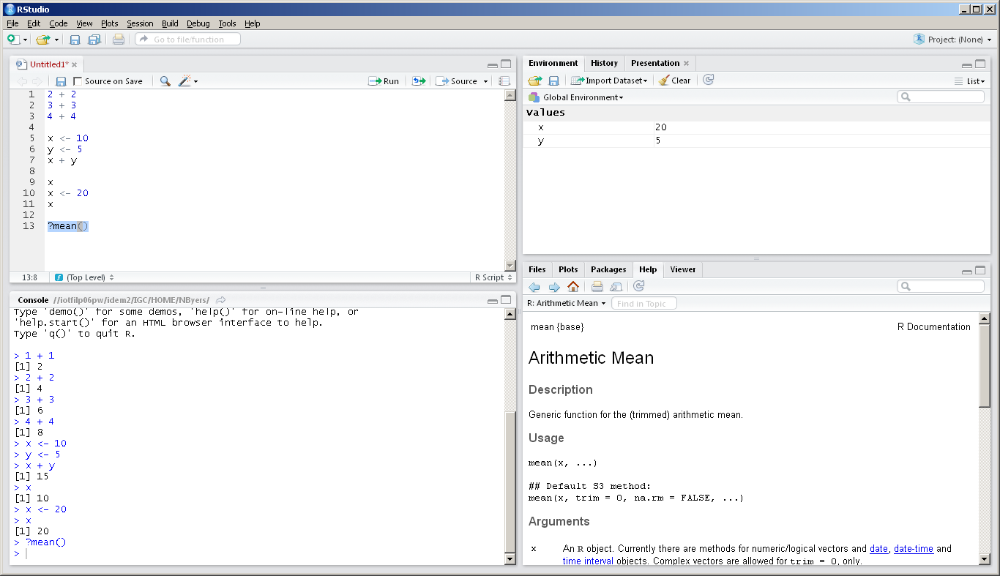
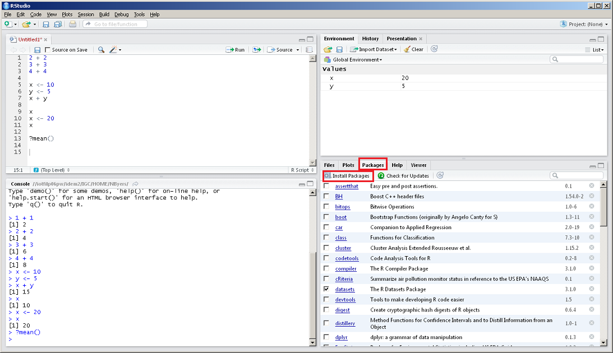
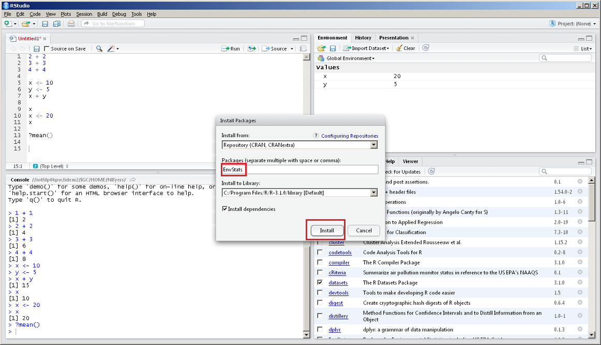

# Topics

In this session we’ll be covering:

- [Built-in functions]{#functions}
- [Using R packages]{#packages}
- [Importing data]{#importing}
- [Data exploration]{#exploration}


# Functions {#functions}

- Now that we have learned how to hold data in R as a variable, we can
start performing tasks on the data using functions. 
- Functions are a way to repeat the same task on different data. 
- R has many built-in functions that perform common tasks

```{r}
x <- c(4, 8, 1, 14, 34)
mean(x) # Calculate the mean of the data set
```

```{r}
y <- c(1, 4, 3, 5, 10, NA)
mean(y, na.rm = TRUE) # Tell the mean function to remove missing data before calculating
```

```{r}
log(27)  #Natural logarithm
```

```{r}
log10(100) #base 10 logarithm
```

```{r}
sqrt(225) # Square root 
```

```{r}
abs(-5) #Absolute value 
```

- They all have the form `function()`
- `function` is the name, which usually gives you a clue about what it does (such as the `mean()` function)
- `()` is where you put your data or indicate options. These are referred to as the _arguments_ of the function.
- To see what goes inside `()`, type a question mark in front of the function and run it

```{r, eval=FALSE}
?mean()
```

In RStudio, you will see the help page for mean() in the bottom right corner help page



- On the help page, under `Usage`, you see `mean(x, ...)`
- This means that the only necessary thing that has to go into `()` is `x`
- On the help page under `Arguments` you will find a description of what `x `needs to be
- You can also use functions in combination with objects you have created

```{r}
answer <- 1+1
log(25 + answer)
```

Many built-in functions in R have multiple arguments, so you have to give the function some more information so that it can perform the correct calculation.

```{r}
round(12.3456) # default is to round to the nearest integer
```

```{r}
round(12.3456, digits=3)  
```

```{r}
round(12.3456, digits=1)
```


## Other Common and Useful Functions
### seq()
The `seq()` function is used to create a vector with a certain sequence. This is used a lot when writing functions. seq(from = 1, to = 1, by = )

```{r}
seq(1, 5, by = 1)
```

```{r}
x <- 1:5  # the colon is a shortcut to create a sequence of integers by 1
x
```


### `paste()`
The paste function will concatenate two or more strings. Paste only works with 
characters so if you give it numbers to paste, it will convert them to characters first.

```{r}
x <- "Hello"
y <- "world!"
paste(x, y, sep = " ")
```

```{r}
x <- "You're number "
y <- 1
z <- "!"
z <- paste(x, y, z, sep = "")
```


### `substr()`
The `substr()` function allows you to pull out only the elements you care about 
in a character vector of dates, addresses, monitor IDs, parameter descriptions, etc.

For example, in AQS data a monitor ID may be written in the following format: 

> [State code - County code - Site number - Parameter code - POC]. 

If we only wanted to pull out the site number for this monitor ID we could do the following:

```{r}
wisconsin_monitor <- c('55-021-0015-44201-2')  # Ozone monitor in Columbia County, WI
site_id <- substr(wisconsin_monitor, start = 8, stop = 11)  # start and stop position within the character string.
site_id
```


## Nesting functions
You can place a function inside another function to perform multiple tasks on data in one step.

For instance, if you want to create a sequence of numbers and then take the mean of that sequence,
you could either do it in a couple of steps, or all at once.

```{r}
#Two steps
x <- seq(from=1, to=10, by=3)
mean(x)
```

```{r}
#One step
mean(seq(from=1, to=10, by=3))  #Make sure you have the parentheses located in the correct spot as R will evaluate from the inside out.
```

_Note: Typically you don’t want to have too many nested functions because it becomes difficult to read._

# Using R packages {#packages}

- R comes with basic functionality, meaning that some functions will always be available when you start an R session
- However, anyone can write functions for R that are not part of the base functionality and make it available to other R users in a package
- Packages must be installed first then loaded before using it
- This is similar to a mobile app: you must first install the R package (like first downloading an app) then you must load the package before using its functions (like opening an app to use it)
- If base R doesn’t have a function you need, just ask Google. Use a search with key words describing what you want the function to do and just add "R package" at the end

For example, if you wanted to  find serial correlation in an environmental data set,
Google would tell you that the R package `EnvStats` has a function called `serialCorrelationTest()`.

First, you might try to use the function.

```{r, error=TRUE}
x <- c(1.3, 3.5, 2.6, 3.4, 6.4)
serialCorrelationTest(x)
```

It’s not available because we need to install the package first (again, like initially downloading an app).

In the bottom right panel of RStudio, click on the "Packages" tab then click "Install Packages" in the tool bar packages.



A window will pop up. Start typing "EnvStats" into the "Packages" box, select that 
package, and click "Install". 



Now that we’ve installed the package, we still can’t use the function we want.
We need to load the package first (opening the app). We use the `library()` function
to do this.

```{r, message=FALSE}
install.packages("EnvStats")
library(EnvStats)
```


Now we can use the function we want

```{r}
x <- c(1.3, 3.5, 2.6, 3.4, 6.4)
serialCorrelationTest(x)
```

Here is a link to a page that lists many, many useful packages for environmental data analysis: https://cran.r-project.org/web/views/Environmetrics.html

Remember, when you close down RStudio, then start it up again, you don’t have to download the package again.
But you do have to load the package to use any function that’s not in the R core functionality (this is very easy to forget).


# Importing data {#importing}

- R can import data from just about any format, including
  - CSV
  - Excel
  - Databases
  - GIS shapefiles
  
## CSV

R has a built-in function for reading `.csv` files. 
  
## Excel

- There are several packages that can be used to import data from an Excel file
  - `xlsx`
  - `XLConnect`
  - `readxl`
