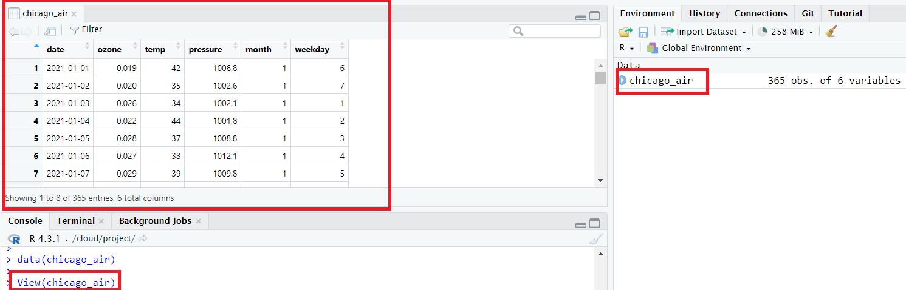

This lesson covers how to subset data using indexing, logical operators, and
the `filter( )` function from `dplyr`. It also covers how to sort and 
combine data frames.

- [Prerequisites](#prerequisites)
- [Viewing Data Frames](#viewing-data-frames)
- [Subsetting](#subsetting)
- [Sorting](#sorting)
- [Combinging Data Frames](#combining-data-frames)
- [Exercises](#exercises)


<br>
<hr>
<br>

# Prerequisites

This lesson assumes you are familiar with the material in the previous lesson on
[Functions and Importing Data](2-Functions-and_Importing-Data/readme.md).

The data from the R package `region5air` is used throughout these lessons.
To install the package from GitHub, use the `remotes` package.


```r
# if you have not installed remotes
install.packages("remotes")

library(remotes)
install_github("FluentData/region5air")
```

To load the `chicago_air` data frame we will be using in the lesson, use the 
`data( )` function. 


```r
library(region5air)

data(chicago_air)
```

You should see the `chicago_air` variable in the top right panel of RStudio, which
means the data frame has been loaded to your R session from the `region5air`
package.


We will also use some functions from the `dplyr` [package](https://dplyr.tidyverse.org/). 
You will need to install the package if you haven't already.


```r
install.package("dplyr")
```

# Viewing Data Frames


We always want to make sure our data looks the way it is supposed to before we 
begin working with it.

The best way to take a quick look at the first few rows of a data frame
is to use the `head()` function


```r
head(chicago_air)  
```

```
##         date ozone temp pressure month weekday
## 1 2021-01-01 0.019   42   1006.8     1       6
## 2 2021-01-02 0.020   35   1002.6     1       7
## 3 2021-01-03 0.026   34   1002.1     1       1
## 4 2021-01-04 0.022   44   1001.8     1       2
## 5 2021-01-05 0.028   37   1008.8     1       3
## 6 2021-01-06 0.027   38   1012.1     1       4
```

You can specify the number of lines to display by using the `n` parameter.


```r
head(chicago_air, n = 3)
```

```
##         date ozone temp pressure month weekday
## 1 2021-01-01 0.019   42   1006.8     1       6
## 2 2021-01-02 0.020   35   1002.6     1       7
## 3 2021-01-03 0.026   34   1002.1     1       1
```

You can also look at the bottom of the data frame by using the `tail( )` function.


```r
tail(chicago_air)
```

```
##           date ozone temp pressure month weekday
## 360 2021-12-26 0.022   53   1003.1    12       1
## 361 2021-12-27 0.019   66    997.3    12       2
## 362 2021-12-28 0.021   42    997.1    12       3
## 363 2021-12-29 0.017   42    997.5    12       4
## 364 2021-12-30 0.022   48    997.0    12       5
## 365 2021-12-31 0.023   62    994.7    12       6
```

In RStudio, you can either click on the name of the data frame in the top right
panel or use the `View( )` function to generate a web based table of the data
in the top left panel.


```r
View(chicago_air)
```



By inspecting the data frame this way, you can see that the records are daily values
of ozone, temperature, and air pressure. For more information about the 
data set you can type a question mark in from the name of the data frame variable
in the console.


```r
?chicago_air
```

From the `Description` section of the help page:

> A dataset containing daily values of ozone, temperature, and barometric pressure
> from a Chicago monitor between January 1, 2021 and December 31, 2021.


# Subsetting

If we want to work with a particular subset of a data frame, we need to know how
to select particular records. We will cover how to subset using numeric indexing,
logical conditions, and the `filter( )` function.

## Indexing

Values in a data frame can be selected, individually or in a group, based on their
index values. These are integers that represent the locations in the data frame.
If there is a 2 x 2 table, then there are 2 rows and 2 columns. Each cell can be 
represented by two numbers, like  coordinates on a map. For a data frame, the format
is `[row, column]`. Below is a table that shows the index values in each cell.

|Column 1 | Column 2|
|---      |---      |
| `[1, 1]`| `[1, 2]`|
| `[2, 1]`| `[2, 2]`|


Below is a data frame called `my_data` that has 3 rows and 2 columns.


```r
my_data <- data.frame(colors = c("red", "green", "yellow"), 
                      fruit = c("apple", "grape", "banana"))

my_data
```

```
##   colors  fruit
## 1    red  apple
## 2  green  grape
## 3 yellow banana
```

To select a particular cell from the `my_data` data frame, we use the `[row, column]`
construction. We place those square brackets at the end of the data frame variable
`my_data[ ]` and use integers to select a value. If we wanted to select the "grape"
value, we would use `my_data[2, 1]`.


```r
my_data[2, 1]
```

```
## [1] "green"
```

To select "banana", we use `my_data[3, 3]`.


```r
my_data[3, 2]
```

```
## [1] "banana"
```

We can also access data from a vector using the same indexing idea. In this case,
you don’t need the comma to separate the rows and columns since you are accessing 
one dimensional data. Below is a vector of numbers.


```r
x <- c(1, 3, 2, 7, 25.3, 6)
x
```

```
## [1]  1.0  3.0  2.0  7.0 25.3  6.0
```

If we want to access the 5th element of the vector, we would use `x[5]`.


```r
x[5]
```

```
## [1] 25.3
```


Now that we understand indexing we can subset the `chicago_air` data frame by 
using the brackets `[ , ]` function. (This is a rare example of a function in
R that does not have the form `function_name( )`.)

To get one row of the data frame, specify the row number you would like in the 
brackets, on the left side of the comma. By leaving the column value on the right
side of the comma blank, it returns all the columns associated with row number 1.


```r
chicago_air[1, ]
```

```
##         date ozone temp pressure month weekday
## 1 2021-01-01 0.019   42   1006.8     1       6
```


If you want more than one row, you can supply a vector of row numbers. Below,
the vector access the 1st, 2nd, and 5th rows of the data frame.


```r
chicago_air[c(1, 2, 5), ] 
```

```
##         date ozone temp pressure month weekday
## 1 2021-01-01 0.019   42   1006.8     1       6
## 2 2021-01-02 0.020   35   1002.6     1       7
## 5 2021-01-05 0.028   37   1008.8     1       3
```

To get a column from the data frame, specify the column number in the brackets, 
to the right of the comma. By leaving the row value blank, you are telling it to
return all rows associated with column 1. Below, we wrap the output in the 
`head()` function to limit the number of rows printed.


```r
head( chicago_air[, 1] )
```

```
## [1] "2021-01-01" "2021-01-02" "2021-01-03" "2021-01-04" "2021-01-05"
## [6] "2021-01-06"
```

As you can see, a vector is returned. When a column of a data frame is selected
a data frame is not returned. This is because a column in a data frame is all the
same data type, and a vector is a simpler representation of the values. But if a
row is selected, the values will not necessarily be the same data type, so a data
frame is returned.

You can also obtain more than one column by supplying a vector of column numbers.


```r
head( chicago_air[, c(3, 4, 6)] )
```

```
##   temp pressure weekday
## 1   42   1006.8       6
## 2   35   1002.6       7
## 3   34   1002.1       1
## 4   44   1001.8       2
## 5   37   1008.8       3
## 6   38   1012.1       4
```

Since more than one column is selected, then a data frame is returned.

A column name can be used to select a vector.


```r
head( chicago_air[, "pressure"] )
```

```
## [1] 1006.8 1002.6 1002.1 1001.8 1008.8 1012.1
```

Or a vector of column names can subset to a slimmed down data frame.


```r
head( chicago_air[, c("ozone", "temp", "month")] )
```

```
##   ozone temp month
## 1 0.019   42     1
## 2 0.020   35     1
## 3 0.026   34     1
## 4 0.022   44     1
## 5 0.028   37     1
## 6 0.027   38     1
```

Both rows and columns can be specified at the same time. The example below
returns the first 5 rows of data and temperature and pressure columns.


```r
chicago_air[1:5, c("temp", "pressure")]  
```

```
##   temp pressure
## 1   42   1006.8
## 2   35   1002.6
## 3   34   1002.1
## 4   44   1001.8
## 5   37   1008.8
```

## Access Column with `$`

In R, the dollar sign `$` is a special character that can be used to access a 
data frame column by name. The dollar sign is placed immediately after the variable
name. For example, if we wanted to access the temperature values in the `chicago_air`
data frame, then we would use `chicago_air$temp`. 


```r
head( chicago_air$temp )
```

```
## [1] 42 35 34 44 37 38
```

Again, a vector is returned because a single column is being accessed. Using `$`
is a  convenient way to grab a column from a data frame, and we will use it throughout
the rest of these lessons.

## Logical Expressions

It's useful to understand how indexing works with data frames. But often,
if we want a subset of data, we want to use a logical expression to keep data
(or discard it).

Below is a table of logical operators in R that can be used to create logical
conditions.


### Reference Table of Logical Operators
|Operator |Description |
| :---    | :---       |
| <	      | less than  |
| <=	    | less than or equal to|
| >	      | greater than |
| >=	    | greater than or equal to |
| ==	    | exactly equal to |
| !=	    | not equal to |
| !x      | not x |
| x & y   | x AND y |
| x <code>&#124;</code> y |	x OR y|

The result of a logical expression is a logical data type, a boolean value `TRUE`
or `FALSE`.


```r
1 + 1 == 2
```

```
## [1] TRUE
```


```r
10 > 20
```

```
## [1] FALSE
```

Vectors can also be used in a logical expression. A vector of values on the left
hand side of a logical operator will return a vector of the same length with
boolean values. 

Here, we check if any of the integers in a vector are above 60. A logical vector
is returned.


```r
c(25, 80, 55) > 60
```

```
## [1] FALSE  TRUE FALSE
```

This concept can be used to subset data frame. A logical vector
can be used in the the similar way to an index vector in the brackets of a data
frame `data_frame[rows, columns]`. Instead of providing a numeric vector that 
corresponds to row numbers, a logical vector that is as long as the data frame
can be used to keep records (`TRUE`) and drop records (`FALSE`).

We can use the data frame of color and fruit again to demonstrate.


```r
my_data <- data.frame(colors = c("red", "green", "yellow"), 
                      fruit = c("apple", "grape", "banana"))

my_data
```

```
##   colors  fruit
## 1    red  apple
## 2  green  grape
## 3 yellow banana
```

If we only wanted records with the "yellow" color, we could use the vector 
`c(FALSE, FALSE, TRUE)`. Place this vector in the brackets of the data frame, 
where we select rows.


```r
my_data[c(FALSE, FALSE, TRUE), ]
```

```
##   colors  fruit
## 3 yellow banana
```

A data frame is returned. The only record is from the 3rd row of the logical vector,
because that was the only `TRUE` value.

But a more useful way of creating the logical vector is with a logical expression.
Below we access the "color" column as a vector using the `$` operator. Then we
create a logical vector using a logical expression. 


```r
colors <- my_data$colors

colors
```

```
## [1] "red"    "green"  "yellow"
```

```r
yellow <- colors == "yellow"

yellow
```

```
## [1] FALSE FALSE  TRUE
```

Now we can use the logical vector `yellow` to subset the data frame down to records
that have the color yellow.


```r
my_data[yellow, ]
```

```
##   colors  fruit
## 3 yellow banana
```

The `chicago_air` data frame can be subset in a similar way. Below, a logical
vector `hot` is created to represent hot days above 90 degrees. The data frame
is subset down to records with hot days.


```r
hot <- chicago_air$temp > 90 

chicago_air[hot, ]
```

```
##           date ozone temp pressure month weekday
## 163 2021-06-12 0.053   91    995.4     6       7
## 169 2021-06-18 0.062   93    997.5     6       6
## 239 2021-08-27 0.044   91   1003.3     8       6
```

### Subset with filter()

A logical vector can also be used in combination with the function `filter( )`.

The `filter( )` function is from a package called `dplyr` which provides many
functions for manipulating data frames. 


```r
# if you have not installed dplyr
# install.packages("dplyr")

library(dplyr)
```

The benefit of using `filter( )` is that it works the way other functions in R
typically work. It used braces with parameters, and not brackets `[ , ]`. The
first parameter is the data frame you want to subset, and the second parameter
is a logical expression. It also allows you to reference the columns in the data
frame by name, without having to access the column using `$`.

If we want to filter down to records in the `chicago_air` data frame where ozone
was above 60 ppb (.060 ppm), we would use the following code.


```r
high_ozone <- filter(chicago_air, ozone > 0.060)

high_ozone
```

```
## # A tibble: 6 × 6
##   date       ozone  temp pressure month weekday
##   <date>     <dbl> <dbl>    <dbl> <dbl>   <dbl>
## 1 2021-05-24 0.061    86    1006.     5       2
## 2 2021-06-04 0.064    83    1001.     6       6
## 3 2021-06-13 0.062    86     999.     6       1
## 4 2021-06-14 0.065    87    1000.     6       2
## 5 2021-06-17 0.062    86    1002.     6       5
## 6 2021-06-18 0.062    93     998.     6       6
```

If we wanted all of the high ozone days in the 6th month, we add another expression
separated by a comma.


```r
high_ozone_june <- filter(chicago_air, ozone > 0.060, month == 6)

high_ozone_june
```

```
## # A tibble: 5 × 6
##   date       ozone  temp pressure month weekday
##   <date>     <dbl> <dbl>    <dbl> <dbl>   <dbl>
## 1 2021-06-04 0.064    83    1001.     6       6
## 2 2021-06-13 0.062    86     999.     6       1
## 3 2021-06-14 0.065    87    1000.     6       2
## 4 2021-06-17 0.062    86    1002.     6       5
## 5 2021-06-18 0.062    93     998.     6       6
```

Additional logical expressions can be added by separating each expression with
a comma. The comma serves as a logical AND. Below is an equivalent output to the
output above, using `&` instead of a comma.


```r
high_ozone_june <- filter(chicago_air, ozone > 0.060 & month == 6)

high_ozone_june
```

```
## # A tibble: 5 × 6
##   date       ozone  temp pressure month weekday
##   <date>     <dbl> <dbl>    <dbl> <dbl>   <dbl>
## 1 2021-06-04 0.064    83    1001.     6       6
## 2 2021-06-13 0.062    86     999.     6       1
## 3 2021-06-14 0.065    87    1000.     6       2
## 4 2021-06-17 0.062    86    1002.     6       5
## 5 2021-06-18 0.062    93     998.     6       6
```


# Sorting 

The `dplyr` package also has a function named `arrange()` that will sort a data
frame. It also take the data frame as the first parameter. The output will be
sorted by the column names that are provided as additional parameters.

Below, the `chicago_air` data frame is ordered by the `ozone` column. The default
is descending order.


```r
# if the dplyr library is not already loaded
library(dplyr)

ozone_ordered <- arrange(chicago_air, ozone)

head(ozone_ordered)
```

```
## # A tibble: 6 × 6
##   date       ozone  temp pressure month weekday
##   <date>     <dbl> <dbl>    <dbl> <dbl>   <dbl>
## 1 2021-10-22 0.012    52    1003.    10       6
## 2 2021-10-28 0.015    53     989.    10       5
## 3 2021-12-29 0.017    42     998.    12       4
## 4 2021-12-18 0.018    42    1009.    12       7
## 5 2021-01-01 0.019    42    1007.     1       6
## 6 2021-01-25 0.019    35    1002.     1       2
```

To use descending order, wrap the column in the `desc( )` function (also from the
`dplyr` package).


```r
ozone_descending <- arrange(chicago_air, desc(ozone))

head(ozone_descending)
```

```
## # A tibble: 6 × 6
##   date       ozone  temp pressure month weekday
##   <date>     <dbl> <dbl>    <dbl> <dbl>   <dbl>
## 1 2021-06-14 0.065    87    1000.     6       2
## 2 2021-06-04 0.064    83    1001.     6       6
## 3 2021-06-13 0.062    86     999.     6       1
## 4 2021-06-17 0.062    86    1002.     6       5
## 5 2021-06-18 0.062    93     998.     6       6
## 6 2021-05-24 0.061    86    1006.     5       2
```

Additional columns can be used to sort the data frame, separated by a comma.


```r
ozone_temp <- arrange(chicago_air, desc(ozone), desc(temp))

head(ozone_temp)
```

```
## # A tibble: 6 × 6
##   date       ozone  temp pressure month weekday
##   <date>     <dbl> <dbl>    <dbl> <dbl>   <dbl>
## 1 2021-06-14 0.065    87    1000.     6       2
## 2 2021-06-04 0.064    83    1001.     6       6
## 3 2021-06-18 0.062    93     998.     6       6
## 4 2021-06-13 0.062    86     999.     6       1
## 5 2021-06-17 0.062    86    1002.     6       5
## 6 2021-05-24 0.061    86    1006.     5       2
```

# Combining Data Frames

If we are working with multiple data frames in R, it might be useful to combine
two or more. The `dplyr` package has another convenient function called
`bind_rows()` that will let you attach two data frames together that have the same
columns.

To illustrate, we will make two subsets of the `chicago_air` data frame, then 
combine them together using the `bind_rows()` function. Below, the original
number of records in the `chicago_air` data frame is shown using the `nrow()`
function. We will split the data frame and recombine to a data frame with the
original number of records.


```r
# if you have not loaded the dplyr package
library(dplyr)

nrow(chicago_air)
```

```
## [1] 365
```

Now we split the data frame into warm and cool data frames using the 
`filter( )` function.


```r
warm <- filter(chicago_air, temp > 80) 

nrow(warm) 
```

```
## [1] 95
```

```r
cool <- filter(chicago_air, temp <= 80) # get cool air records

nrow(cool) 
```

```
## [1] 270
```

We can confirm that the rows from these two data frames add up to the original
data frame.


```r
nrow(warm) + nrow(cool) == nrow(chicago_air)
```

```
## [1] TRUE
```

Now we combine using the `bind_rows()` function and confirm that the new `recombined`
data frame has the same number of records as the original data frame.


```r
recombined <- bind_rows(warm, cool) 

nrow(recombined) == nrow(chicago_air)
```

```
## [1] TRUE
```

# Next Lesson

The next lesson in this series is on 
[Writing Functions, Conditionals, and Loops](../4-Writing-Functions-Conditionals-and-Loops/readme.md).

# Exercises

Try these exercises to test your comprehension of material in this lesson.

### Exercise 1

Load the `chicago_air` dataset from the `region5air` package and display the first 
10 rows of the dataset using the numeric index.

<details><summary>Click for Solution</summary>

> Use the `data()` function to load the data frame into your R session and a
vector from 1 to 10 in the first position of the brackets `[ , ]`. Make sure the
`regionair` package is loaded first with the `library()` function.


```r
library(region5air)

data("chicago_air")

chicago_air[1:10, ]
```

```
## # A tibble: 10 × 6
##    date       ozone  temp pressure month weekday
##    <date>     <dbl> <dbl>    <dbl> <dbl>   <dbl>
##  1 2021-01-01 0.019    42    1007.     1       6
##  2 2021-01-02 0.02     35    1003.     1       7
##  3 2021-01-03 0.026    34    1002.     1       1
##  4 2021-01-04 0.022    44    1002.     1       2
##  5 2021-01-05 0.028    37    1009.     1       3
##  6 2021-01-06 0.027    38    1012.     1       4
##  7 2021-01-07 0.029    39    1010.     1       5
##  8 2021-01-08 0.031    35    1007.     1       6
##  9 2021-01-09 0.032    32    1012.     1       7
## 10 2021-01-10 0.032    29    1014.     1       1
```

</details>

---


### Exercise 2

Use the `filter()` function to subset the `chicago_air` data frame to values where
ozone is above 0.060 ppm and the temperature is above 90 degrees.


<details><summary>Click for Solution</summary>

> Load the `dplyr` package using `library()` and use logical expressions to 
get records where `ozone` is greater than 0.06 and `temp` is greater than 90.

#### Solution


```r
library(dplyr)

filter(chicago_air, ozone > .06, temp > 90)
```

```
## # A tibble: 1 × 6
##   date       ozone  temp pressure month weekday
##   <date>     <dbl> <dbl>    <dbl> <dbl>   <dbl>
## 1 2021-06-18 0.062    93     998.     6       6
```

</details>

---


### Exercise 3

Use the `arrange( )` function to sort the `chicago_air` data frame in descending
chronological order.

<details><summary>Click for Solution</summary>

> Wrap the `date` column in the `desc( )` function.

#### Solution


```r
descending <- arrange(chicago_air, desc(date))

head(descending)
```

```
## # A tibble: 6 × 6
##   date       ozone  temp pressure month weekday
##   <date>     <dbl> <dbl>    <dbl> <dbl>   <dbl>
## 1 2021-12-31 0.023    62     995.    12       6
## 2 2021-12-30 0.022    48     997     12       5
## 3 2021-12-29 0.017    42     998.    12       4
## 4 2021-12-28 0.021    42     997.    12       3
## 5 2021-12-27 0.019    66     997.    12       2
## 6 2021-12-26 0.022    53    1003.    12       1
```

</details>


