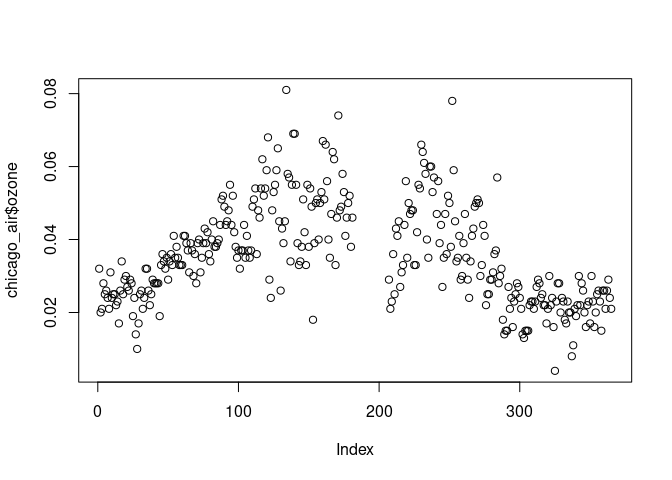

# Working with R `data.frame`s

We'll begin by loading the `chicago_air` `data.frame` from the `region5air`
[package on GitHub](https://github.com/NateByers/region5air).


```r
library(region5air)

data(chicago_air)
```


We always want to make sure our data looks the way it is supposed to before we 
begin working with it.

The best way to take a quick look at the first few rows of a data frame
is to use the `head()` function


```r
head(chicago_air)  
```

```
##         date ozone temp solar month weekday
## 1 2013-01-01 0.032   17  0.65     1       3
## 2 2013-01-02 0.020   15  0.61     1       4
## 3 2013-01-03 0.021   28  0.17     1       5
## 4 2013-01-04 0.028   18  0.62     1       6
## 5 2013-01-05 0.025   26  0.48     1       7
## 6 2013-01-06 0.026   36  0.47     1       1
```
You can specify the number of lines to display by using the n = parameter


```r
head(chicago_air, n = 3)
```

```
##         date ozone temp solar month weekday
## 1 2013-01-01 0.032   17  0.65     1       3
## 2 2013-01-02 0.020   15  0.61     1       4
## 3 2013-01-03 0.021   28  0.17     1       5
```

You can also look at the bottom of the data frame by using `tail()`


```r
tail(chicago_air)
```

```
##           date ozone temp solar month weekday
## 360 2013-12-26 0.026   NA  0.41    12       5
## 361 2013-12-27 0.021   NA  0.62    12       6
## 362 2013-12-28 0.026   NA  0.61    12       7
## 363 2013-12-29 0.029   NA  0.08    12       1
## 364 2013-12-30 0.024   NA  0.44    12       2
## 365 2013-12-31 0.021   NA  0.49    12       3
```

The table function is helpful for summarizing your data by counts and the `plot()`
and `hist()` functions allow you to quickly visualize the data


```r
table(chicago_air$ozone)  ##Summarizes by counts
```

```
## 
## 0.004 0.008  0.01 0.011 0.013 0.014 0.015 0.016 0.017 0.018 0.019  0.02 0.021 
##     1     1     1     1     1     3     6     4     5     3     3     6    11 
## 0.022 0.023 0.024 0.025 0.026 0.027 0.028 0.029  0.03 0.031 0.032 0.033 0.034 
##    10    12    12    12    11     6    13    12     8     5     6    12     8 
## 0.035 0.036 0.037 0.038 0.039  0.04 0.041 0.042 0.043 0.044 0.045 0.046 0.047 
##    13     8     8     8    11     6     9     4     4     7     6     4     5 
## 0.048 0.049  0.05 0.051 0.052 0.053 0.054 0.055 0.056 0.057 0.058 0.059  0.06 
##     6     5     7     6     5     4     5     6     3     3     3     3     2 
## 0.061 0.062 0.064 0.065 0.066 0.067 0.068 0.069 0.074 0.078 0.081 
##     1     2     2     1     2     1     1     2     1     1     1
```

```r
plot(chicago_air$ozone)  # Quick plot of data
```

<!-- -->

```r
hist(chicago_air$ozone)  #Like a historgram plot except no binning occurs
```

<!-- -->


# Indexing

If we want to look at a small subset of the data, you can subset by using the 
index values of the `data.frame` to grab particular rows and columns. An index 
value is just like reading coordinates on a map, where the format is `[rows, columns]`.
Below is an example of how you access a particular value in a `data.frame` based on its index.


```r
my_data <- data.frame(x = 1:5, y = 6:10)
my_data[4, 2] ## This should grab the value in the 4th row and 2nd column 
```

```
## [1] 9
```


We can also access data from a vector using the same indexing idea. In this case,
you don’t need the comma to separate the rows and columns since you are accessing 
one dimensional data.


```r
x <- c(1, 3, 2, 7, 25.3, 6)
x[5]  # This will access the fifth element in the vector
```

```
## [1] 25.3
```


Now that we understand indexing we can subset the `chicago_air` data frame by using the 
`[` function.

# Subsetting Using Indexing
To get one row of the data frame, specify the row number you would like in the 
brackets, on the left side of the comma. By leaving the column value on the right
side of the comma blank, it returns all the columns associated with row number 1.


```r
chicago_air[1, ]
```

```
##         date ozone temp solar month weekday
## 1 2013-01-01 0.032   17  0.65     1       3
```


If you want more than one row, you can supply a vector of row numbers


```r
chicago_air[c(1, 2, 5), ] #Accesses the 1, 2 and 5th rows of data
```

```
##         date ozone temp solar month weekday
## 1 2013-01-01 0.032   17  0.65     1       3
## 2 2013-01-02 0.020   15  0.61     1       4
## 5 2013-01-05 0.025   26  0.48     1       7
```

To get a column from the data frame, specify the column number in the brackets, 
to the right of the comma. By leaving the row value blank, you are telling it to
return all rows associated with column 1.


```r
head( chicago_air[, 1] )
```

```
## [1] "2013-01-01" "2013-01-02" "2013-01-03" "2013-01-04" "2013-01-05"
## [6] "2013-01-06"
```

You can obtain more than one column by supplying a vector of column numbers


```r
head( chicago_air[, c(3, 4, 6)] )
```

```
##   temp solar weekday
## 1   17  0.65       3
## 2   15  0.61       4
## 3   28  0.17       5
## 4   18  0.62       6
## 5   26  0.48       7
## 6   36  0.47       1
```

Column names can also be used.


```r
head( chicago_air[, "solar"] )
```

```
## [1] 0.65 0.61 0.17 0.62 0.48 0.47
```

Or a vector of column names


```r
head( chicago_air[, c("ozone", "temp", "month")] )
```

```
##   ozone temp month
## 1 0.032   17     1
## 2 0.020   15     1
## 3 0.021   28     1
## 4 0.028   18     1
## 5 0.025   26     1
## 6 0.026   36     1
```

Both rows and columns can be specified at the same time. 


```r
chicago_air[1:5, 3:5]  # Returns first 5 rows of data and the third through fifth columns.
```

```
##   temp solar month
## 1   17  0.65     1
## 2   15  0.61     1
## 3   28  0.17     1
## 4   18  0.62     1
## 5   26  0.48     1
```

# Logical Operators
You can also subset a data frame by using logical expressions
The logical expression is used to specify rows that you want to keep or discard


## Reference Table of Logical Operators
|Operator |Description |
| :---    | :---       |
| <	      | less than  |
| <=	    | less than or equal to|
| >	      | greater than |
| >=	    | greater than or equal to |
| ==	    | exactly equal to |
| !=	    | not equal to |
| !x      | not x |
| x & y   | x AND y |
| x <code>&#124;</code> y |	x OR y|

Here is an example using a logical expression to subset.


```r
logical_vector <- chicago_air$solar > 1.45 # records with greater than 1.45 in the solar column

chicago_air[logical_vector, ] 
```

```
##           date ozone temp solar month weekday
## 144 2013-05-24 0.034   48  1.49     5       6
## 164 2013-06-13 0.040   64  1.46     6       5
## 170 2013-06-19 0.046   67  1.46     6       4
## 193 2013-07-12    NA   NA  1.47     7       6
```


Another helpful tool when subsetting is the complete.cases function.
This function allows us to only look at data where observations for all columns are complete.
The function returns a logical vector that can be used to subset a `data.frame`.


```r
complete <- complete.cases(chicago_air)

air <- chicago_air[complete,] 
```


_We will use the `air` `data.frame` for the rest of the subsetting
examples._


Let's say we only want rows in this `data.frame` where ozone was above 70 ppb (.070 ppm).


```r
ozone_violation <- air[(air$ozone > .070), ]  # This returns all the days with readings above .070 ppm

ozone_violation
```

```
##           date ozone temp solar month weekday
## 134 2013-05-14 0.081   74  1.40     5       3
## 171 2013-06-20 0.074   80  1.35     6       5
## 252 2013-09-09 0.078   83  1.11     9       2
```


If we wanted all of the days in the 7th month, we could use the `==` operator.


```r
air[(air$month == 7), ]
```

```
##           date ozone temp solar month weekday
## 207 2013-07-26 0.029   69  0.29     7       6
## 208 2013-07-27 0.021   61  0.89     7       7
## 209 2013-07-28 0.023   60  1.15     7       1
## 210 2013-07-29 0.036   66  1.19     7       2
## 211 2013-07-30 0.025   73  0.92     7       3
## 212 2013-07-31 0.043   67  0.50     7       4
```

Or if we want all days except the 6th day, we would use `!=`.


```r
head( air[(air$weekday != 6), ] ) #Excludes all data from the 6th day of the week
```

```
##         date ozone temp solar month weekday
## 1 2013-01-01 0.032   17  0.65     1       3
## 2 2013-01-02 0.020   15  0.61     1       4
## 3 2013-01-03 0.021   28  0.17     1       5
## 5 2013-01-05 0.025   26  0.48     1       7
## 6 2013-01-06 0.026   36  0.47     1       1
## 7 2013-01-07 0.024   25  0.65     1       2
```

We can combine logical conditions with `&` (the _AND_ operator)

If we wanted only rows where the temperature was between 80 and 85 (including those numbers)


```r
air[(air$temp >= 80 & air$temp <= 85), ]
```

```
##           date ozone temp solar month weekday
## 121 2013-05-01 0.068   80  1.36     5       4
## 140 2013-05-20 0.069   81  1.38     5       2
## 150 2013-05-30 0.038   82  1.09     5       5
## 168 2013-06-17 0.062   84  1.44     6       2
## 171 2013-06-20 0.074   80  1.35     6       5
## 172 2013-06-21 0.048   81  0.60     6       6
## 174 2013-06-23 0.058   82  1.35     6       1
## 178 2013-06-27 0.050   83  1.35     6       5
## 219 2013-08-07 0.056   82  1.05     8       4
## 232 2013-08-20 0.061   82  1.16     8       3
## 233 2013-08-21 0.058   85  1.16     8       4
## 237 2013-08-25 0.060   84  1.20     8       1
## 238 2013-08-26 0.053   84  1.01     8       2
## 250 2013-09-07 0.050   83  1.11     9       7
## 252 2013-09-09 0.078   83  1.11     9       2
## 254 2013-09-11 0.045   81  0.95     9       4
```

We can also use `|` (the _OR_ operator) to select rows on days 3 or 5

```r
head( air[(air$weekday == 3 | air$weekday == 5),] )
```

```
##          date ozone temp solar month weekday
## 1  2013-01-01 0.032   17  0.65     1       3
## 3  2013-01-03 0.021   28  0.17     1       5
## 8  2013-01-08 0.021   30  0.39     1       3
## 10 2013-01-10 0.024   33  0.42     1       5
## 15 2013-01-15 0.017   19  0.66     1       3
## 17 2013-01-17 0.034   33  0.69     1       5
```

# Subsetting using the subset() function

You can also use the `subset()` function to filter a `data.frame` down to the records
you want. The first argument in the function is the name of the `data.frame` and
the second argument is the logical expression. No need to use `$` for column names.


```r
high_temp <- subset(air, temp > 90)  

head(high_temp)
```

```
##           date ozone temp solar month weekday
## 253 2013-09-10 0.059   91  1.15     9       3
```

By using the select = parameter you can specify which columns to keep

```r
high_temp_ozone <- subset(air, temp > 90, select = c(ozone, temp))

head(high_temp_ozone)
```

```
##     ozone temp
## 253 0.059   91
```


# Sorting data 

You can sort the rows of a `data.frame` using the `order()` function. For 
example, we can sort the `chicago_air` dataset by ozone. The output of the `order()`
function is a vector of integers that map to the ascending order of the input. 


```r
ozone_ordered <- order(air$ozone)

head(ozone_ordered)
```

```
## [1] 15 35  2  3  8 23
```

We can use the output to arrange the rows of the `data.frame` by placing the 
ordered vector on the left side of the `[, ]` operator.


```r
air_ozone_ascending <- air[ozone_ordered, ] 

head(air_ozone_ascending)
```

```
##          date ozone temp solar month weekday
## 15 2013-01-15 0.017   19  0.66     1       3
## 44 2013-02-13 0.019   36  0.85     2       4
## 2  2013-01-02 0.020   15  0.61     1       4
## 3  2013-01-03 0.021   28  0.17     1       5
## 8  2013-01-08 0.021   30  0.39     1       3
## 32 2013-02-01 0.021  -17  0.81     2       6
```


You can easily sort the `data.frame` in descending order by reversing the
ordered vector, using the `rev()` function.


```r
air_ozone_descending <- air[rev(ozone_ordered), ] 

head(air_ozone_descending)
```

```
##           date ozone temp solar month weekday
## 134 2013-05-14 0.081   74  1.40     5       3
## 252 2013-09-09 0.078   83  1.11     9       2
## 171 2013-06-20 0.074   80  1.35     6       5
## 140 2013-05-20 0.069   81  1.38     5       2
## 139 2013-05-19 0.069   73  1.21     5       1
## 121 2013-05-01 0.068   80  1.36     5       4
```

# Combining `data.frame`s

`data.frame`s can be combined using the `rbind()`  and `cbind()` functions, standing
for "row bind" and "column bind" respectively. 

The `rbind()` function requires that there to be an an equal number of columns
among the `data.frame`s. To illustrate, we will make two subsets of the `air`
`data.frame` and then combine them using `rbind()`.


```r
nrow(air) # show the original number of records
```

```
## [1] 241
```

```r
air_warm <- subset(air, temp > 80) # get warm air records

nrow(air_warm) # show the number of records
```

```
## [1] 17
```

```r
air_cool <- subset(air, temp <= 80) # get cool air records

nrow(air_cool) # show number of records
```

```
## [1] 224
```

```r
air_recombined <- rbind(air_warm, air_cool) # combine the data.frames

nrow(air_recombined) # number of records
```

```
## [1] 241
```


