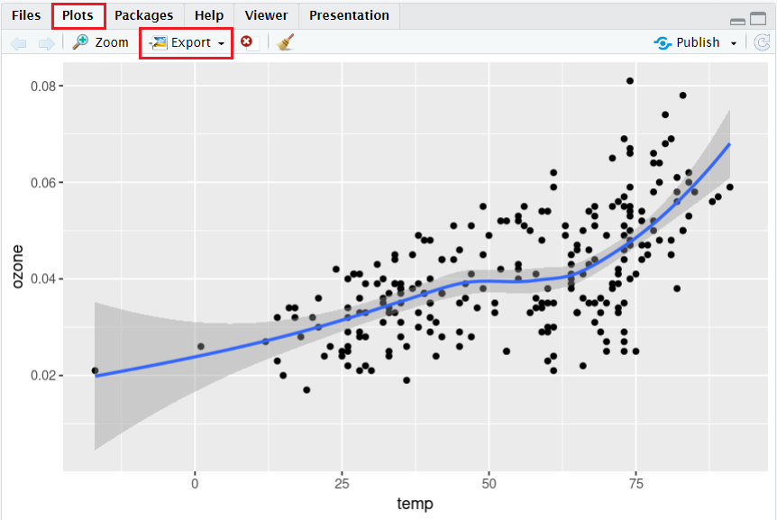

In this lesson you will first learn how to quickly visualize data using a few base
plotting functions. The rest of the material explains how to use the `ggplot2` package
to build more complicated, multi-faceted plots.


- [Prerequisites](#prerequisites)
- [Base Plots](#base-plots)
- [ggplot2](#ggplot2)
- [Saving Plots](#saving-plots)
- [Exercises](#exercises)

<br>
<hr>
<br>

# Prerequisites

This lesson assumes you are familiar with the material in the lesson on
[Subsetting, Sorting, and Combining Data Frames](../3-Subsetting-Sorting-and-Combining/readme.md).
It also uses functions from the `ggplot2` package which needs to be installed.

```{r, eval=FALSE}
install.packages("ggplot2")
```

The data from the R package `region5air` is used throughout these lessons.
To install the package from GitHub, use the `remotes` package. Run the code
below to install the `remotes` package and install `region5air` from GitHub.

```{r, eval=FALSE}
# if you have not installed remotes
install.packages("remotes")

library(remotes)
install_github("FluentData/region5air")
```

To load the `chicago_air` data frame we will be using in the lesson, use the 
`library()` function to load the `region5air` package, then the `data( )` function
to load the data frame. 

```{r}

library(region5air)

data(chicago_air)

```


# Base Plots

The most basic way to visualize data in R is the `plot()` function. A numeric vector
will be displayed on the y-axis of a coordinate graph, with the index number of the
vector taking the x-axis values.

```{r}
benzene <- c(1.3, 4.5, 2.6, 3.4, 6.4)

plot(benzene)
```


A second vector can be supplied for the scatter plot, and you can control which
vector is printed on the x-axis and which is printed on the y-axis. Below we use
the `chicago_air` data frame to create a scatterplot of temperature on the x-axis
and ozone on the y-axis`.

```{r}
plot(x = chicago_air$temp, y = chicago_air$ozone)
```

To see data plotted over time, we need to convert the `date` column to a `Date`
data type. 

```{r}

chicago_air$date <- as.Date(chicago_air$date)

```


Here is ozone plotted by day as a line graph.

```{r}
plot(x = chicago_air$date, y = chicago_air$ozone, type = 'l')
```

The `type` argument controls the type of plot, and there are many other arguments
to control the look of the graph. The plot below demonstrates a few of these
options. Run `?plot` to see a list of all the arguments in the help file.

```{r}


plot(x = chicago_air$date, y = chicago_air$ozone, 
     type='l', 
     pch = 16,
     col = "purple", 
     lwd = 2.5,
     xlab="Date", 
     ylab = 'Ozone (ppm)', 
     main = 'Chicago Ozone Data')


```


## Histogram

Another base plot function is `hist()`. It's used to visualize the distribution
of a data set as a histogram. Below is the default output of the ozone data
from the `chicago_air` data frame.

```{r}
hist(chicago_air$ozone)
```

We can control the number of bars in the plot, or where the breakpoints are for
each bar, with the `breaks` argument. For example, supplying `breaks = 20` will
make a histogram with 20 bars. Other arguments allow you to control the titles and colors of the plot. Run `?hist` to see a complete list of arguments on the help
page.

```{r}

hist(chicago_air$ozone, 
     breaks = 20,
     main = "Histogram of Ozone",
     xlab = "ppm",
     col = "steelblue")

```

## Box Plot

Another good way to visualize the distribution of a data set is the box plot. The
base function `boxplot()` takes either a vector or a data frame in the `data`
argument. If a data frame is used, then the columns can be referenced without the
`$` operator, and a formula must be used.

Here's an example using the ozone column from the `chicago_air` data frame.

```{r}
boxplot(chicago_air$ozone)
```

The box shows the interquartile range (IQR), with the bold line indicating the
median of the ozone values. The horizontal lines at the end of the dotted line 
are the min and max ozone values within a certain range from the box (specifically,
1.5 times the IQR). If a value falls outside that range, it will be reprsented by
a point (the default point type is a circle). Overall, the plot gives an idea of
where the middle half of the values are, and if there are extreme values beyond
that.

The benefit of supplying a data frame to the `data` argument is to break the data
up into groups and display each group in a box plot. If a data frame is used, then
the `x` argument must be a _formula_. In R, a formula is a data type that represents
an equation like y = x. The way to represent this relationship in R is with the
`~` character: `y ~ x`. The `boxplot()` function needs a formula to know which 
column in the data frame is being plotted, and which column is used to do the 
grouping. We can make a plot of ozone by month using the `chicag_air` data frame.


```{r}
boxplot(ozone ~ month, data = chicago_air)
```


# ggplot2

`ggplot2` is a popular data visualization package in R. It uses a layered approach
to build plots which allows you to add, remove, or change components modular
way.

To use `ggplot2`, we typically follow this sequence of steps:

1.  Start with the `ggplot()` function where we specify the dataset and
    map variables to aesthetics (visual properties of objects in the
    plot like shapes or colors).
2.  Add `geoms` – geometric objects like points (`geom_point` for
    scatter plots), bars (`geom_bar` for bar plots), or lines
    (`geom_line` for line plots) that determine the type of the plot.
3.  Finally, customize and refine the plot with additional layers like
    labels, themes, facets etc.

Let's begin by loading the `ggplot2` package. 

```{r}
library(ggplot2)
```
 
Let's recreate the base scatter plot of ozone and temperature from the previous 
section, starting with the `ggplot( )` function. The first argument `data` takes
the data frame. The `mapping` argument takes another function named `aes()`, which
is short for aesthetic. The primary arguments in the `aes( )` function are `x`
and `y`. These determine which column from the data frame.

```{r}

ggplot(chicago_air, aes(x = temp, y = ozone))

```

The code above creates the base plot, which is a coordinate system in the scale
of ozone and temperature, but is empty. The next step is to add more information
to the plot, which is done by adding a function using the `+` sign. For a point
plot, we add the `geom_point()` function.

```{r}


ggplot(chicago_air, aes(x = temp, y = ozone)) + geom_point()


```


Additional modifications can be made. Let's customize it by adding color, title,
and labels.


```{r}

ggplot(chicago_air, aes(x = temp, y = ozone)) +
  geom_point(color = "forestgreen") +
  ggtitle('Relationship between Ozone and Temperature') +
  xlab('Temperature (°F)') +
  ylab('Ozone (ppm)')

```


The `aes()` function can also map aesthetic properties like color based on other
columns in the data frame. We could want each point to have a different color based
on the month. To do this, we need to make the month column a factor and use the
argument `color` in the `aes( )` function.

```{r}

ggplot(chicago_air, aes(x = temp, y = ozone, color = factor(month))) +
  geom_point() +
  ggtitle('Relationship between Ozone and Temperature') +
  xlab('Temperature (°F)') +
  ylab('Ozone (ppm)')


```

The `factor()` function converts the data type of the month column to a `factor`
class. This class represents categorical variables in R. See the 
[lesson on regression](../7-Regression-and-Data-Transformation/readme.md) for more
details on factors in R.

To create a line plot of ozone over time, we use the `as.Date()` function on the date
column and replace the `geom_point( )` function with the `geom_line( )` function.

```{r}

ggplot(chicago_air, aes(x = as.Date(date), y = ozone)) + geom_line()

```


The `geom_histogram()` function will create a histogram. The `bin` argument controls
the width of each bar, the `fill` argument the color of the bars, and the `color` 
argument the outline of the bars.

```{r}

ggplot(chicago_air, aes(ozone)) + 
  geom_histogram(binwidth=0.005, fill='darkorange', color='black')

```

The `geom_boxplot()` function will create a box plot.

```{r}

ggplot(chicago_air, aes(ozone)) + geom_boxplot()

```

Using the `y` argument can split the data into groups. Here we use the `factor()`
function on the month column to create 12 box plots on the graph. 

```{r}

ggplot(chicago_air, aes(x = ozone, y = factor(month))) + geom_boxplot()

```


See the [documentation site for ggplot2](https://ggplot2.tidyverse.org/reference/index.html#geoms)
for a complete list of `geom_` functions available.

## Facets

Another way to modify `ggplot2` plots is to break up the data into groups and make
multiple plots or facets. The `facet_wrap()` function allows you to use a column
to choose the facets. Below is a faceted histogram of ozone values.

```{r}

ggplot(chicago_air, aes(ozone)) +
  geom_histogram() +
  facet_wrap("month")

```


## Fitted Lines

`ggplot2` also makes it easy to plot fitted lines and shaded confidence intervals
on graphs. The function `geom_smooth()` will create a line representing the relationship
between the x and y variables. The 95% confidence interval of that line will be
represented as a shaded area. Below, the argument `method` is given the value
`lm` which stands for a linear model. 


```{r, message=FALSE, warning=FALSE}

ggplot(chicago_air, aes(temp, ozone) ) +
  geom_point() + 
  geom_smooth(method=lm)

```

You can also fit curves to the data. For example, choosing `loess` for the `method`
argument will draw a nonlinear curve which represents localized relationships between
the x and y variables.

```{r, message=FALSE, warning=FALSE}

ggplot(chicago_air, aes(temp, ozone) ) +
  geom_point() + 
  geom_smooth(method=loess)

```

# Saving Plots

Plots can be saved in RStudio using the "Export" button at the top of the "Plots"
pane.



You can also save a plot made by `ggplot2` using the `ggsave()` function..

```{r, eval=FALSE}

my_plot <- ggplot(chicago_air, aes(temp, ozone) ) +
  geom_point() + 
  geom_smooth(method=loess)

ggsave(filename = "my_plot.png", plot = my_plot)

```

# Next Lesson

The next lesson in this series is on 
[Regression and Data Transformation](../7-Regression-and-Data-Transformation/readme.md).

# Exercises

Try these exercises to test your comprehension of material in this lesson.

### Exercise 1

Make a scatter plot of barometric pressure  and ozone from the `chicago_air`
data frame. Use the `plot()` function with ozone on the y axis, and provide helpful
labels to the axes.

<details><summary>Click for Solution</summary>


#### Solution

```{r}
plot(x = chicago_air$pressure, y = chicago_air$ozone,
     xlab = "Barometric Pressure",
     ylab = "Ozone")
```


</details>

---

### Exercise 2

Use the `plot()` function to make a line plot of temperature over time from the
`chicago_air` data frame. Make sure the `date` column has the `Date` class and
the line is red.

<details><summary>Click for Hint</summary>

> Use the `class()` function to check the class of the `date` column. If it is
not a `Date` class, use `as.Date()` to transform that column.

</details>

<details><summary>Click for Solution</summary>

#### Solution

```{r}
# if date column is not a Date class
chicago_air$date <- as.Date(chicago_air$date)

plot(x = chicago_air$date, y = chicago_air$temp, type = "l", col = "red")

```

</details>

---

### Exercise 3

With `ggplot2`, make box plots of ozone from the `chicago_air` data frame. Use the
`weekday` column as a factor on on y-axis. 

<details><summary>Click for Hint</summary>

> Use the `factor()` function on the `weekday` column in the `ggplot()` function.

</details>

<details><summary>Click for Solution</summary>

#### Solution


```{r}

ggplot(chicago_air, aes(x = ozone, y = factor(weekday))) +
  geom_boxplot() +
  facet_wrap("month")

```

</details>

---

### Exercise 4

Use `ggplot2` to plot histograms of barometric pressure values for each month 
from the the `chicago_air` data frame.

<details><summary>Click for Hint</summary>

> Use the `facet_wrap()` function to make a histogram for each month.

</details>

<details><summary>Click for Solution</summary>

#### Solution

```{r}

ggplot(chicago_air, aes(pressure)) +
  geom_histogram() +
  facet_wrap("month")
```

</details>

