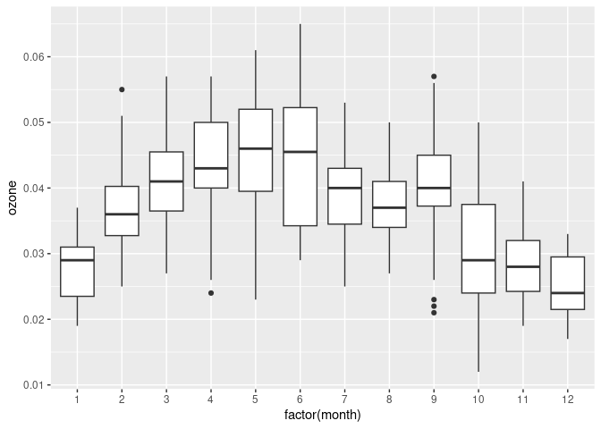
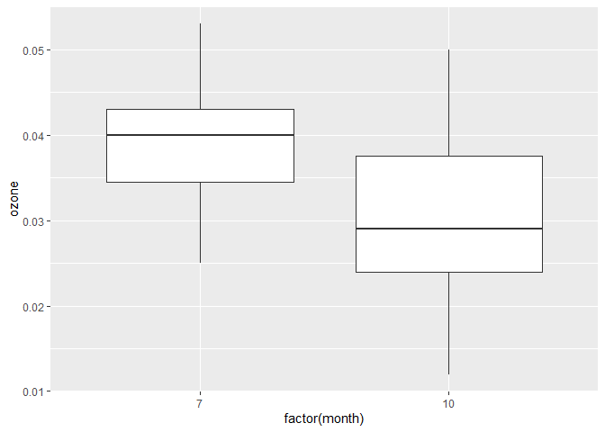
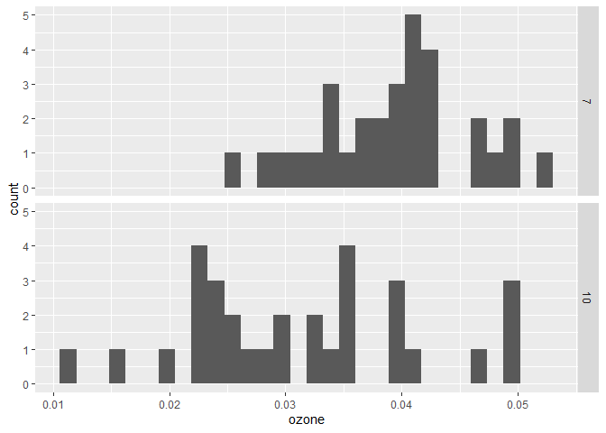
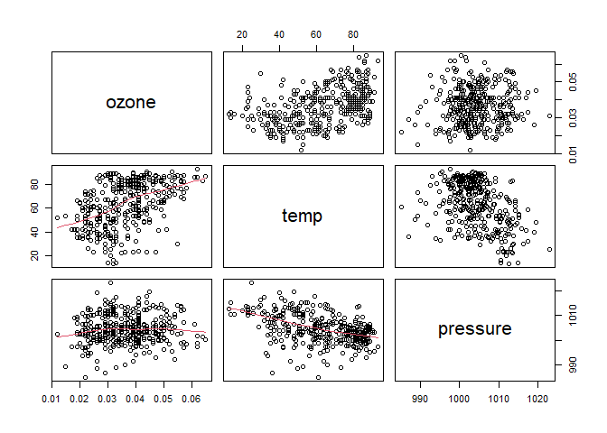
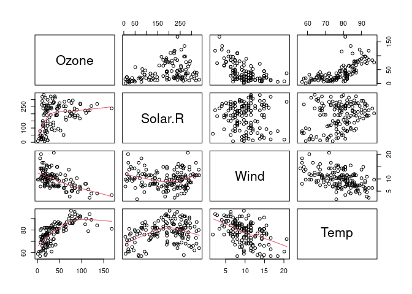

R was originally developed as a statistical programming language and its built-in
functions are commonly used for basic statistics. There are also many community 
developed packages that make it easy to perform statistical analyses. This tutorial
will cover descriptive statistics functions and some statistical tests that might
be used on environmental data.


- [Prerequisites](#prerequisites)
- [Descriptive Statistics](#descriptive-statistics)
- [Statistical Tests](#statistical-tests)
- [Correlation Analysis](#correlation-analysis)
- [Exercises](#exercises)

<br>
<hr>
<br>

# Prerequisites

This lesson assumes you are familiar with the lesson on
[Functions and Importing Data](../2-Functions-and-Importing-Data/readme.md).

Statistical functions are used in this lesson that require installation of the
`envstats` package. 


```r
install.packages("envstats")
```

The data from the R package `region5air` is used throughout these lessons.
To install the package from GitHub, use the `remotes` package. Run the code
below to install the `remotes` package and install `region5air` from GitHub.


```r
# if you have not installed remotes
install.packages("remotes")

library(remotes)
install_github("FluentData/region5air")
```

To load the `chicago_air` data frame we will be using in the lesson, use the 
`library()` function to load the `region5air` package, then the `data( )` function
to load the data frame. 


```r
library(region5air)

data(chicago_air)
```


# Descriptive Statistics

R has many built-in functions for descriptive statistics. We will use these 
functions to understand the ozone data in the `chicago_air` data frame.


```r
ozone <- chicago_air$ozone
```

Most of the functions we'll be using have an argument named `na.rm` that stands 
for `NA` remove. If the argument is set to `TRUE` then the function will remove
all missing values from the data set. Otherwise the function will error.

These functions tell us the range of the ozone values, i.e. the highest and 
lowest values.


```r
min(ozone, na.rm=TRUE)
```

```
## [1] 0.012
```


```r
max(ozone, na.rm=TRUE)
```

```
## [1] 0.065
```


```r
range(ozone, na.rm=TRUE)
```

```
## [1] 0.012 0.065
```

We can also get the mean and the quartile values from the `summary()` function.


```r
summary(ozone)
```

```
##    Min. 1st Qu.  Median    Mean 3rd Qu.    Max.    NA's 
## 0.01200 0.02900 0.03600 0.03665 0.04300 0.06500       2
```

The `IQR()` function gives us the interquartile range, which lets us know how large
the spread is for the values in the central range of the distribution, i.e. between
the 25th percentile and the 75th percentile.


```r
IQR(ozone, na.rm=TRUE)
```

```
## [1] 0.014
```

We can use the `boxplot()` function to visualize the interquartile range. The outline
of the box itself shows the middle 50% of the data, while the line in the middle
of the box shows the median.


```r
boxplot(ozone)
```

<!-- -->

## Measures of Central Tendency and Dispersion

R has functions for finding the mean and median of a set of values.


```r
mean(ozone, na.rm=TRUE)
```

```
## [1] 0.03665014
```


```r
median(ozone, na.rm=TRUE)
```

```
## [1] 0.036
```

The functions `var()` and `sd()`calculate the variance and standard 
deviation respectively.


```r
var(ozone, na.rm=TRUE)
```

```
## [1] 0.0001037198
```


```r
sd(ozone, na.rm=TRUE)
```

```
## [1] 0.01018429
```

# Statistical Tests

R has many built-in functions for statistical tests. As an example, we'll use
the `t.test()` function to perform a two sample t-test on the Chicago ozone data.

First, let's visualize our dataset using boxplots by month.


```r
library(ggplot2)
ggplot(chicago_air, aes(factor(month), ozone)) + geom_boxplot()
```

<!-- -->

We could compare ozone months in July and October and see if there is a significant
difference in concentrations. Below is a plot of those two months side by 
side.


```r
library(dplyr)

ozone_july_october <- filter(chicago_air, month == 7 | month == 10)

ggplot(ozone_july_october, aes(factor(month), ozone)) + geom_boxplot()
```

<!-- -->


We should also check for normality before doing any statistical tests. Below
are histograms of the datasets.


```r
ggplot(ozone_july_october, aes(ozone)) + 
  facet_grid(rows = "month") + 
  geom_histogram()
```

```
## `stat_bin()` using `bins = 30`. Pick better value with `binwidth`.
```

<!-- -->

If plotting does not obviously show normality, we can use the built-in function
`shapiro.test()`. This function performs the Shapiro-Wilk test on a dataset, which
assumes that the data set is normal. So the null hypothesis is that the dataset
comes from a normal distribution. If the p-value of the test is less than .05, 
we reject the null hypothesis and conclude the data is not normal.


```r
chicago_july <- filter(chicago_air, month == 7)

shapiro.test(chicago_july$ozone)
```

```
## 
## 	Shapiro-Wilk normality test
## 
## data:  chicago_july$ozone
## W = 0.98703, p-value = 0.9629
```


```r
chicago_october <- filter(chicago_air, month == 10)

shapiro.test(chicago_october$ozone)
```

```
## 
## 	Shapiro-Wilk normality test
## 
## data:  chicago_october$ozone
## W = 0.96295, p-value = 0.3484
```

The p-values for the tests are well above 0.05, so we assume the null hypothesis
is true. Meaning, we can assume the distributions of ozone in the two months
are normal.

Now we can do some comparisons between these 2 months of measurements using the 
Student's t-test. The test is meant to determine if the two means from the two
datasets are from the same distribution or not. The assumption, or null hypothesis,
is that they are in fact mean values from the same distribution. 


```r
t.test(chicago_july$ozone, chicago_october$ozone)
```

```
## 
## 	Welch Two Sample t-test
## 
## data:  chicago_july$ozone and chicago_october$ozone
## t = 3.8345, df = 52.116, p-value = 0.0003409
## alternative hypothesis: true difference in means is not equal to 0
## 95 percent confidence interval:
##  0.003906027 0.012481069
## sample estimates:
##  mean of x  mean of y 
## 0.03938710 0.03119355
```

The `t.test()` output shows a p-value well below .05, so we reject the null hypothesis.
Meaning, the two means are not from the same distribution, and we can consider the
two data sets significantly different in that sense.

## Other Statistical Tests

Below is a reference table of a few popular tests for categorical data analysis in R.

test |	function |
---|---|
Chi Square Test	| `chisq.test()`
Fisher's Test	| `fisher.test()`
Analysis of Variance |	`aov()`


The `EnvStats` package has a comprehensive list of basic and more advanced statistical
tests for Environmental Data.


```r
library(EnvStats)

?FcnsByCatHypothTests
```

# Correlation Analysis

If we are interested in how closely the variables in our dataset are related
to each other, we can perform a correlation analysis.

A correlation matrix tells us how positively or negatively correlated each variable
is to the other variables. Below, we use the `cor()` function to print a correlation 
matrix of the numeric columns in the `chicago_air` data frame, specifying in the
arguments that we only want to include complete observations and the Pearson method
of finding correlations.


```r
cor(chicago_air[, c("ozone", "temp", "pressure")], 
    use = "complete.obs", 
    method ="pearson") 
```

```
##               ozone       temp    pressure
## ozone    1.00000000  0.4597041  0.06305432
## temp     0.45970410  1.0000000 -0.42988592
## pressure 0.06305432 -0.4298859  1.00000000
```

Along the diagonal, the correlation value is 1, because each variable is perfectly
correlated with itself. The closer the other values are to 1 or -1, the more 
correlated the two variables are. A correlation value of 0 means the two variables
are not correlated at all. The matrix above shows a weak correlation between
ozone and temperature, a weak negative correlation between air pressure and temperature,
and no correlation between ozone and air pressure. 

We could also perform a correlation test using the `cor.test()` function. Here
we test the correlation between ozone and temperature.


```r
cor.test(chicago_air$ozone, chicago_air$temp, method = "pearson")
```

```
## 
## 	Pearson's product-moment correlation
## 
## data:  chicago_air$ozone and chicago_air$temp
## t = 9.8352, df = 361, p-value < 2.2e-16
## alternative hypothesis: true correlation is not equal to 0
## 95 percent confidence interval:
##  0.3744913 0.5372169
## sample estimates:
##       cor 
## 0.4597041
```

The null hypothesis of the test is that the correlation is 0, there is no 
correlation at all. The p-value is well below .05 so we reject the null hypothesis
and conclude that ozone and temperature are correlated to some degree.

Running the test between ozone and air pressure gives a p-value above .05 so we
do not reject the null hypothesis. We conclude there is no correlation between
ozone and air pressure.


```r
cor.test(chicago_air$ozone, chicago_air$pressure, method = "pearson")
```

```
## 
## 	Pearson's product-moment correlation
## 
## data:  chicago_air$ozone and chicago_air$pressure
## t = 1.2004, df = 361, p-value = 0.2308
## alternative hypothesis: true correlation is not equal to 0
## 95 percent confidence interval:
##  -0.04013951  0.16491725
## sample estimates:
##        cor 
## 0.06305432
```

It's also useful to see pairwise plots for numeric values to see the relationships
between the variables. The built in `pairs()` function will display a scatter
plot between each pair of columns in the data frame. Setting `lower.panel = panel.smooth`
will draw a smooth line through the scatter plots on the lower panels.


```r
pairs(chicago_air[, c("ozone", "temp", "pressure")], lower.panel = panel.smooth)  
```

<!-- -->

You can see from the lower panel plots the increasing slope of the line for ozone
and temp; a decreasing slope for temp and pressure; and a flat line for ozone and
pressure.

# Next Lesson

The next lesson in this series is on 
[Quality Assurance](../7-Quality-Assurance/readme.md).

# Exercises

Try these exercises to test your comprehension of material in this lesson.

## Exercise 1

Find the mean and median of the temperature column in the `chicago_air` data frame
and compare the two values.

<details><summary>Click for Solution</summary>

### Solution

> Use the `mean()` and `median()` functions and find the absolute value between
them with the `abs()` function.


```r
temp_mean <- mean(chicago_air$temp)

temp_mean
```

```
## [1] 63.52603
```

```r
temp_median <- median(chicago_air$temp)

temp_median 
```

```
## [1] 66
```

```r
abs(temp_mean - temp_median)
```

```
## [1] 2.473973
```

</details>

---

## Exercise 2

Use the Shapiro-Wilk normality test to see if the air pressure column in the 
`chicago_air` data frame is normally distributed.

<details><summary>Click for Solution</summary>

### Solution

> Use the `shapiro.test()` function. The p-value is above .05, so we can assume
the data is normally distributed.


```r
shapiro.test(chicago_july$pressure)
```

```
## 
## 	Shapiro-Wilk normality test
## 
## data:  chicago_july$pressure
## W = 0.97563, p-value = 0.6839
```

</details>

---

## Exercise 3

Create a correlation matrix of the numeric columns in the built-in `airquality`
data frame. Use `data("airquality")` to load the data frame.

<details><summary>Click for Solution</summary>

### Solution

> Use the `cor()` function on the Ozone, Solar.R, Wind, and Temp columns.


```r
data("airquality")

cor(airquality[, c("Ozone", "Solar.R", "Wind", "Temp")],
    use = "complete.obs", 
    method ="pearson")
```

```
##              Ozone    Solar.R       Wind       Temp
## Ozone    1.0000000  0.3483417 -0.6124966  0.6985414
## Solar.R  0.3483417  1.0000000 -0.1271835  0.2940876
## Wind    -0.6124966 -0.1271835  1.0000000 -0.4971897
## Temp     0.6985414  0.2940876 -0.4971897  1.0000000
```
</details>

---

## Exercise 4

Create pairwise plots for all of the numeric columns in the `airquality` data 
frame. Have the lower-panel plots generate a smooth line representing relationship
between the two variables.

<details><summary>Click for Solution</summary>

### Solution

> Use the `pairs()` function on the Ozone, Solar.R, Wind, and Temp columns.


```r
pairs(airquality[, c("Ozone", "Solar.R", "Wind", "Temp")], lower.panel = panel.smooth)  
```

<!-- -->

</details>
