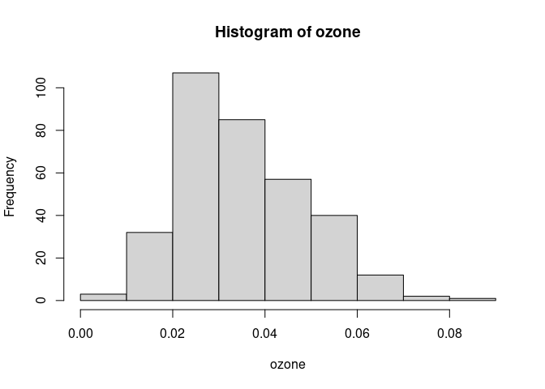
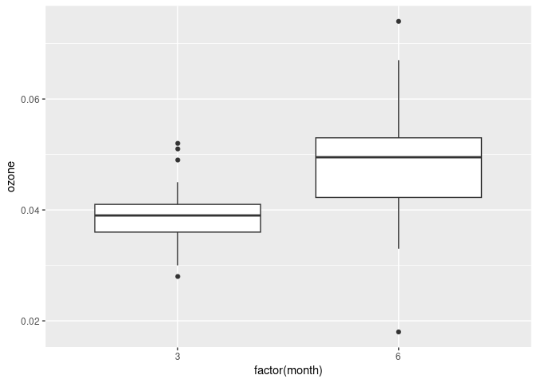
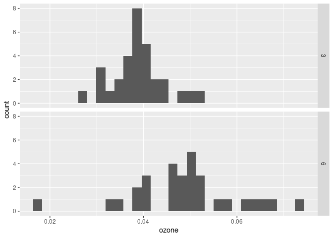
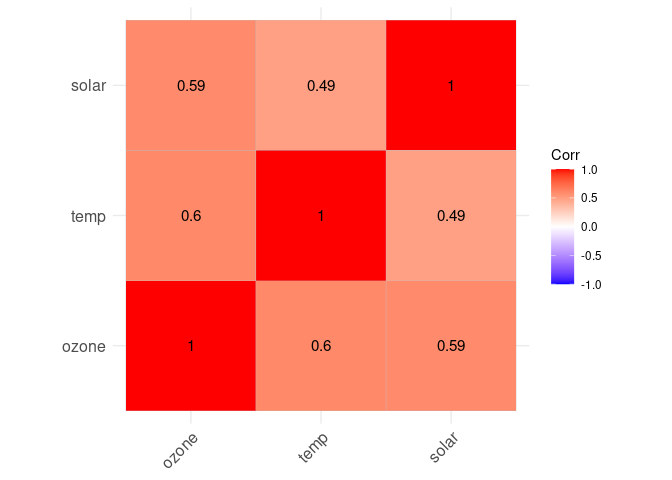
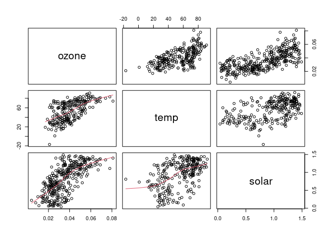
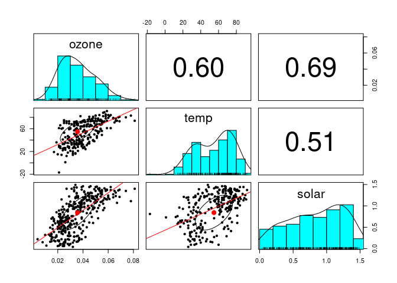

## Basic Statistics

R was originally developed as a statistical programming language and is commonly
used to perform basic statistics. There are also many community developed packages
that make it easy to perform statistical analyses. This tutorial will cover
some statistical tests that might be used on environmental data.

First we load the `chicago_air` ozone data so that we can run some basic 
statistics on it. We will give the ozone column its own variable name so that we
can access it quickly.


```r
library(region5air)
data(chicago_air)
ozone <- chicago_air$ozone
```


### Descriptive and exploratory statistics

There are several built-in functions for descriptive statistics. The functions
below all have a parameter `na.rm` that tells the function to remove `NA` values
when performing the calculation.


```r
min(ozone, na.rm=T)
```

```
## [1] 0.004
```


```r
max(ozone, na.rm=T)
```

```
## [1] 0.081
```


```r
range(ozone, na.rm=T)
```

```
## [1] 0.004 0.081
```


```r
summary(ozone)
```

```
##    Min. 1st Qu.  Median    Mean 3rd Qu.    Max.    NA's 
## 0.00400 0.02500 0.03400 0.03567 0.04500 0.08100      26
```

The `hist()` and `boxplot()` functions plot a histogram and boxplot respectively,
which helps to visualize the distribution of the values.


```r
hist(ozone)
```

<!-- -->


```r
boxplot(ozone)
```

<!-- -->


### Measures of central tendency

R has functions for finding the mean and median of a set of values.


```r
mean(ozone, na.rm=T)
```

```
## [1] 0.03567257
```


```r
median(ozone, na.rm=T)
```

```
## [1] 0.034
```


### Measures of dispersion

The functions `var()`, `sd()`, and `IQR()` calculate the variance, standard 
deviation, and interquartile range respectively.


```r
var(ozone,na.rm=T)
```

```
## [1] 0.0001878067
```


```r
sd(ozone,na.rm=T)
```

```
## [1] 0.01370426
```


```r
IQR(ozone,na.rm=T)
```

```
## [1] 0.02
```

## Useful packages for statistics

Below are some helpful functions that provide statistical descriptions from 
the packages `Hmisc`, `psych`, and `pastecs`.


```r
# install.packages("Hmisc")
library(Hmisc)
describe(ozone)
```

```
## ozone 
##        n  missing distinct     Info     Mean      Gmd      .05      .10 
##      339       26       63    0.999  0.03567  0.01545   0.0160   0.0200 
##      .25      .50      .75      .90      .95 
##   0.0250   0.0340   0.0450   0.0550   0.0591 
## 
## lowest : 0.004 0.008 0.01  0.011 0.013, highest: 0.068 0.069 0.074 0.078 0.081
```


```r
# install.packages("psych")
library(psych)
describeBy(ozone)
```

```
##    vars   n mean   sd median trimmed  mad min  max range skew kurtosis se
## X1    1 339 0.04 0.01   0.03    0.03 0.01   0 0.08  0.08 0.53    -0.14  0
```


```r
# install.packages("pastecs")
library(pastecs)

stat.desc(ozone, norm=T) 
```

```
##       nbr.val      nbr.null        nbr.na           min           max 
##  3.390000e+02  0.000000e+00  2.600000e+01  4.000000e-03  8.100000e-02 
##         range           sum        median          mean       SE.mean 
##  7.700000e-02  1.209300e+01  3.400000e-02  3.567257e-02  7.443131e-04 
##  CI.mean.0.95           var       std.dev      coef.var      skewness 
##  1.464069e-03  1.878067e-04  1.370426e-02  3.841680e-01  5.320220e-01 
##      skew.2SE      kurtosis      kurt.2SE    normtest.W    normtest.p 
##  2.008322e+00 -1.382295e-01 -2.616528e-01  9.745048e-01  1.059749e-05
```


## Statistical tests

R has many built-in functions for statistical tests. As an example, we'll use
the `t.test()` function to perform a two sample t-test on the Chicago ozone data.

First, let’s plot our dataset and look at ozone values by month.


```r
library(ggplot2)
ggplot(chicago_air, aes(factor(month), ozone)) + geom_boxplot()
```

<!-- -->

We could compare ozone months in March and June and see if there is a significant
difference in concentrations. 


```r
ozone_march_june <- chicago_air[chicago_air$month %in% c(3, 6), ]

ggplot(ozone_march_june, aes(factor(month), ozone)) + geom_boxplot()
```

<!-- -->


We should also check for normality before doing any statistical tests. Below
are histograms of the datasets.


```r
ggplot(ozone_march_june, aes(ozone)) + 
  facet_grid(rows = "month") + 
  geom_histogram()
```

```
## `stat_bin()` using `bins = 30`. Pick better value with `binwidth`.
```

<!-- -->


We can also perform a Shapiro-Wilk test using the `shapiro.test()` function.


```r
ozone_march <- ozone_march_june[ozone_march_june$month == 3, "ozone"]

shapiro.test(ozone_march)
```

```
## 
## 	Shapiro-Wilk normality test
## 
## data:  ozone_march
## W = 0.95858, p-value = 0.2674
```


```r
ozone_june <- ozone_march_june[ozone_march_june$month == 6, "ozone"]

shapiro.test(ozone_june)
```

```
## 
## 	Shapiro-Wilk normality test
## 
## data:  ozone_june
## W = 0.96908, p-value = 0.5142
```

The p-value for the tests are well above 0.05, so it fails to reject the null
hypothesis. Meaning, we can assume the distribution of ozone in the two months
are normal.

Now we can do some comparisons between these 2 months of readings using the 
student's t test.


```r
t.test(ozone_march, ozone_june)
```

```
## 
## 	Welch Two Sample t-test
## 
## data:  ozone_march and ozone_june
## t = -4.425, df = 42.163, p-value = 6.68e-05
## alternative hypothesis: true difference in means is not equal to 0
## 95 percent confidence interval:
##  -0.014798103 -0.005528778
## sample estimates:
##  mean of x  mean of y 
## 0.03890323 0.04906667
```


The `t.test()` output shows that these means are in fact different.

## Correlation analysis

If we want to look at how all the variables in our dataset relate to each other,
correlation analysis is very useful.

To run a correlation test, all of the values you give it must be numeric; therefore, 
dates or character values won’t work. We need to subset our data to just the 
numeric columns that we want to test for correlation. You will want to save the 
results to a variable so you can use it for plotting later.

First we make a `data.frame` that is a subset of the numeric columns of our
dataset.


```r
chicago_numeric <- chicago_air[, c("ozone", "temp", "solar")]
```

Then we use the `cor()` function to print a correlation matrix, specifying in the
arguments that we only want to include complete observations (no records with 
missing values) and the Pearson method of finding correlations.


```r
cor_matrix <- cor(chicago_numeric, 
                  use = "complete.obs", 
                  method ="pearson") 
 
cor_matrix
```

```
##           ozone      temp     solar
## ozone 1.0000000 0.6035925 0.5926064
## temp  0.6035925 1.0000000 0.4923545
## solar 0.5926064 0.4923545 1.0000000
```

To perform a correlation test, we use the `cor.test()` function.


```r
cor.test(chicago_air$solar, chicago_air$temp, method = "pearson")
```

```
## 
## 	Pearson's product-moment correlation
## 
## data:  chicago_air$solar and chicago_air$temp
## t = 9.4859, df = 254, p-value < 2.2e-16
## alternative hypothesis: true correlation is not equal to 0
## 95 percent confidence interval:
##  0.4148735 0.5966489
## sample estimates:
##       cor 
## 0.5114604
```

The `ggcorrplot` package uses `ggplot2` to create a correlation matrix graph.


```r
library(ggcorrplot)

ggcorrplot(cor_matrix, lab = TRUE)
```

<!-- -->


## Pairwise plots

It's also useful to see pairwise plots for numeric values. There is a built-in
`pairs()` function in R, as well as a `pairs.panels()` function from the
`psych` package.


```r
pairs(chicago_numeric, lower.panel=panel.smooth)  
```

<!-- -->


```r
library(psych)

pairs.panels(chicago_numeric, lm = TRUE) 
```

<!-- -->

## Other statistical tests

Below is a reference table of a few popular tests for categorical data analysis in R.

test |	function |
---|---|
Chi Square Test	| chisq.test()
Fisher’s Test	| fisher.test()
Analysis of Variance |	aov()


The `EnvStats` package has a comprehensive list of basic and more advanced statistical tests for Environmental Data.


```r
# install.packages("EnvStats")

library(EnvStats)

?EnvStats
```
