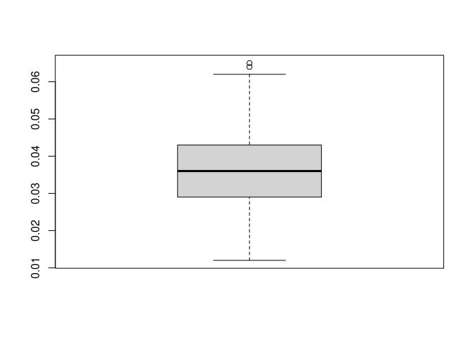
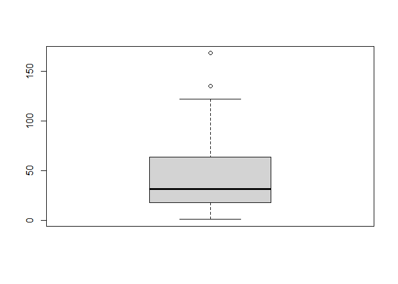

Quality assurance (QA) in R could refer to at least two things: the quality of the
code, or the quality of the data. Advanced R users that develop their own functions
should follow general best practices for software development. The package
[testthat](https://testthat.r-lib.org/) is useful to ensure that functions are
working the way they are intended to work. However, this lesson focuses on _data_ 
quality, and points out a few common mistakes when using R. 

- [Prerequisites](#prerequisites)
- [Data Quality Assurance](#data-quality-assurance)
- [Common Mistakes](#common-mistakes)
- [Exercises](#exercises)

<br>
<hr>
<br>


# Prerequisites

This lesson assumes you are familiar with the material in the lesson on
[Functions and Importing Data](../2-Functions-and-Importing-Data/readme.md).

The data from the R package `region5air` is used throughout these lessons.
To install the package from GitHub, use the `remotes` package. Run the code
below to install the `remotes` package and install `region5air` from GitHub.


```r
# if you have not installed remotes
install.packages("remotes")

library(remotes)
install_github("FluentData/region5air")
```

To load the `chicago_air` data frame we will be using in the lesson, use the 
`library()` function to load the `region5air` package, then the `data( )` function
to load the data frame. 


```r
library(region5air)

data(chicago_air)
```


# Data Quality Assurance

## Data Types

Data types are the first thing to consider when using data in R. Many errors can
happen if we assume that our data is a certain type, when in reality it is not.
After reading data into R, we should look at the data types in RStudio or using 
the function `str()`. 


```r
str(chicago_air)
```

```
## Classes 'tbl_df', 'tbl' and 'data.frame':	365 obs. of  6 variables:
##  $ date    : Date, format: "2021-01-01" "2021-01-02" ...
##  $ ozone   : num  0.019 0.02 0.026 0.022 0.028 0.027 0.029 0.031 0.032 0.032 ...
##  $ temp    : num  42 35 34 44 37 38 39 35 32 29 ...
##  $ pressure: num  1007 1003 1002 1002 1009 ...
##  $ month   : num  1 1 1 1 1 1 1 1 1 1 ...
##  $ weekday : num  6 7 1 2 3 4 5 6 7 1 ...
```

We can see that the numeric columns have the `num` data type, and the `date` column
is the `Date` data type. Dates are often the source of errors in R. The `date` 
column has the appropriate `Date` class, but often, dates will have the `character`
data type when first importing into R. 

Here is an example of text that is read into R, and the `date` column is `character`.


```r
pollution <- read.csv(text = "
date,ozone
2022-08-01,.05
2022-08-02,.06
2022-08-03,.07
")

str(pollution)
```

```
## 'data.frame':	3 obs. of  2 variables:
##  $ date : chr  "2022-08-01" "2022-08-02" "2022-08-03"
##  $ ozone: num  0.05 0.06 0.07
```

If we use this data frame to plot the ozone values, the `date` column will not be
interpreted as a date. Other R functions that use dates and times will also not
work the way we expect. We can use the `as.Date()` function to transform the column
after reading the data, or we can use the `colClasses` argument in the `read.csv`
function.


```r
pollution <- read.csv(colClasses = c("Date", "numeric"), text = "
date,ozone
2022-08-01,.05
2022-08-02,.06
2022-08-03,.07
")

str(pollution)
```

```
## 'data.frame':	3 obs. of  2 variables:
##  $ date : Date, format: "2022-08-01" "2022-08-02" ...
##  $ ozone: num  0.05 0.06 0.07
```

## Unallowed Data

For both character and numeric data types, there may be values that should not 
be allowed. To check all of the character values in a vector, we use the function
`unique()`. Suppose we have a vector of pollutant names.


```r
pollutants <- c("benzene", "benzene", "ethylene", "C6H6", "methanol", "ethylene")
```

If the vector was much longer and we could not easily see all of the names at 
once, we could use the `unique()` function to see a short printout of each character
value represented in the vector. 


```r
unique(pollutants)
```

```
## [1] "benzene"  "ethylene" "C6H6"     "methanol"
```

In this case, there are two names representing benzene: `benzene` and `C6H6`.
We can use a logical expression to replace the `C6H6` values with `benzene` to
make the vector consistent.


```r
pollutants[pollutants == "C6H6"] <- "benzene"

pollutants
```

```
## [1] "benzene"  "benzene"  "ethylene" "benzene"  "methanol" "ethylene"
```

We might also have pollutant values that are not allowed. Here is a vector
of monitor values.


```r
monitor_values <- c(5, 10, -1, 4, 0, -3, 9, 8, 6)
```

If the vector was long and we could not easily see all of the values printed,
we could use the `summary()` function to see if there are any negative values.


```r
summary(monitor_values)
```

```
##    Min. 1st Qu.  Median    Mean 3rd Qu.    Max. 
##  -3.000   0.000   5.000   4.222   8.000  10.000
```

Since the minimum value is `-3`, we know that there are negative values which 
are not allowed. In R, the best way to represent missing values, or values
that we know are wrong, is to use the value `NA`. It stands for "not available"
and is similar to a `NULL` value in a database. 

We can use a logical expression to replace the negative values with `NA`.


```r
monitor_values[monitor_values < 0] <- NA

monitor_values
```

```
## [1]  5 10 NA  4  0 NA  9  8  6
```

## Outliers

Handling outliers is difficult because we do not necessarily want to remove data
that may be uncommon but within the realm of possibility. The best way to detect
extreme values is to look at the summary of your data and pay attention to min and
max values. You can plot the data to see if you can detect anything weird through
visual inspection. Boxplots with outliers plotted as points are handy for this. 
Below is a boxplot of the ozone column in the `chicago_air` data frame.


```r
boxplot(chicago_air$ozone)
```

<!-- -->

We can see that two values are printed as points on the high end of the distribution.
We can use the `boxplot.stats()` function to get the values used in the `boxplot()`
function. The `out` values are the outliers.


```r
boxplot.stats(chicago_air$ozone)$out
```

```
## [1] 0.064 0.065
```

# Common Mistakes

Aside from data quality, you might also make mistakes that are common for R users.


If you run a command and get an error, then R should print an error message. In 
most cases, the message is useful for pinpointing which line of code
the error is in. Common syntax mistakes are:

- missing commas


```r

x <- c("a", "b" "c")
```

```
## Error: <text>:2:17: unexpected string constant
## 1: 
## 2: x <- c("a", "b" "c"
##                    ^
```

- unmatched parentheses


```r

sum(c(1, 2, 3)
```

```
## Error: <text>:4:0: unexpected end of input
## 2: sum(c(1, 2, 3)
## 3: 
##   ^
```

- the wrong type of closing brace [for example, an 
opening square bracket but a closing parenthesis).


```r

x <- list(a = 1:3, b = c("a", "b"))

for(i in 1:2) {
  
  print(x[i))
  
}
```

```
## Error: <text>:6:12: unexpected ')'
## 5:   
## 6:   print(x[i)
##               ^
```

Errors of the `object not found` variety can have one of several causes:
    - The name is not spelled correctly, or the capitalization is wrong
    - The package or file containing the object is not on the search list

When it's not obvious what the printed error message is referring to, the best
strategy is to put the message in a Google search. And although it may be outdated
in some cases, the online document [R Inferno](https://www.burns-stat.com/pages/Tutor/R_inferno.pdf)
is still a great resource for dealing with common R errors.

# Exercises

Try these exercises to test your comprehension of material in this lesson.

## Exercise 1

Find the data types for the built-in `airquality` data frame.

<details><summary>Click for Solution</summary>

### Solution

> Use `data("airquality")` to load the data frame and `str()` to print the data
types.


```r
data("airquality")

str(airquality)
```

```
## 'data.frame':	153 obs. of  6 variables:
##  $ Ozone  : int  41 36 12 18 NA 28 23 19 8 NA ...
##  $ Solar.R: int  190 118 149 313 NA NA 299 99 19 194 ...
##  $ Wind   : num  7.4 8 12.6 11.5 14.3 14.9 8.6 13.8 20.1 8.6 ...
##  $ Temp   : int  67 72 74 62 56 66 65 59 61 69 ...
##  $ Month  : int  5 5 5 5 5 5 5 5 5 5 ...
##  $ Day    : int  1 2 3 4 5 6 7 8 9 10 ...
```

</details>

---

## Exercise 2

Create the vector `monitors <- c("site 1", "site two", "site 2", "site one")`. 
Use logical expressions to standardize the character values.


<details><summary>Click for Solution</summary>

### Solution

> Replace each value usinge a logical expression and the assignment operator
`<-`.


```r
monitors <- c("site 1", "site two", "site 2", "site one")

monitors[monitors == "site one"] <- "site 1"

monitors[monitors == "site two"] <- "site 2"

monitors
```

```
## [1] "site 1" "site 2" "site 2" "site 1"
```

</details>

---

## Exercise 3

Use a boxplot to check for outliers in the ozone column of the built-in `airquality`
data frame.

<details><summary>Click for Solution</summary>

### Solution

> Use `data("airquality")` to load the data frame and `boxplot()` to plot the 
distribution of the `Ozone` column.


```r
data("airquality")

boxplot(airquality$Ozone)
```

<!-- -->

</details>
