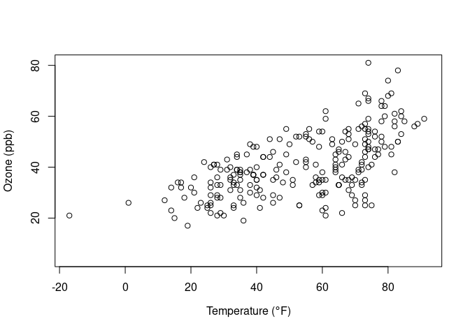
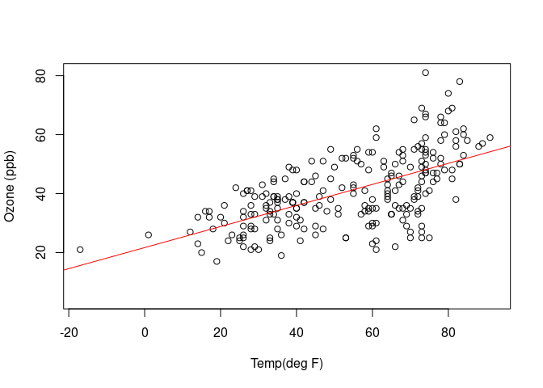
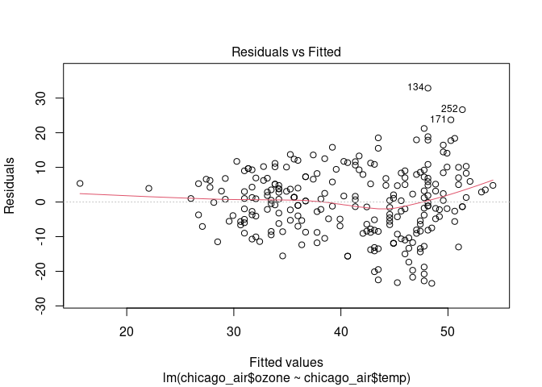
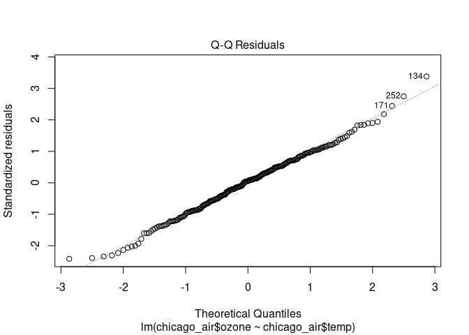
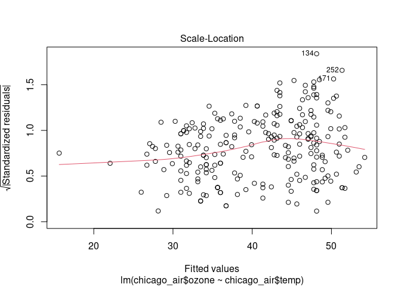
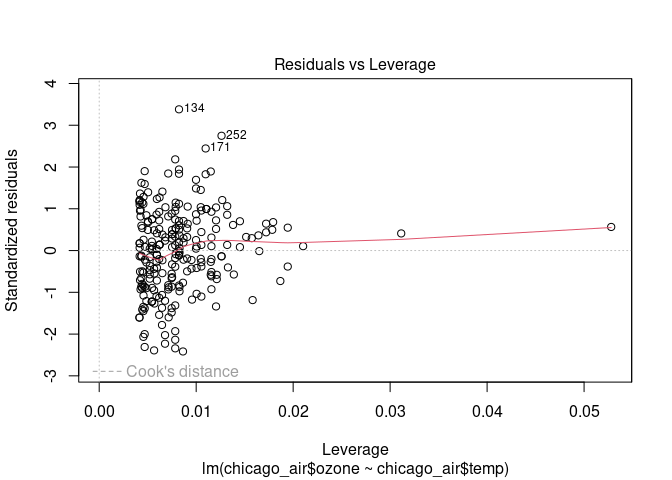
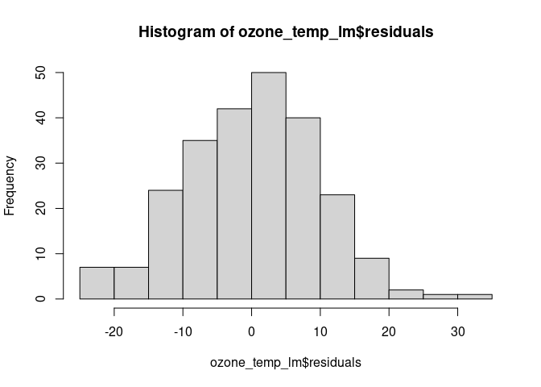
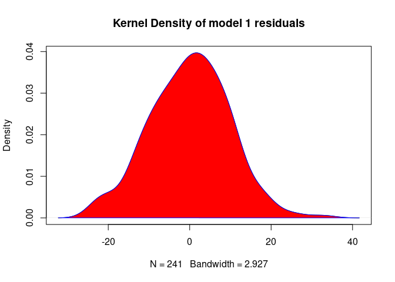
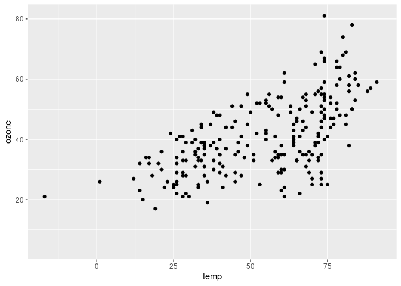
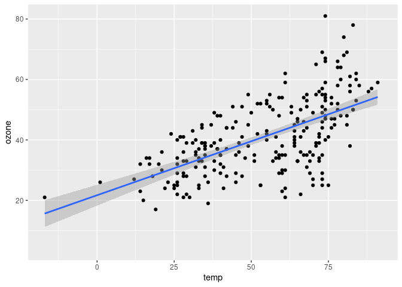

## Linear regression

We use linear regression to figure out what the relationship is between certain 
parameters commonly measured (e.g. temperature, solar radiation, humidity, wind,
etc) and chemicals of interest (e.g. ozone).

So we may want to know, what is the relationship between ozone and temperature 
for our Chicago data? We will use linear regression, namely the lm() function in
R, to explore this relationship.

First, we should plot our variables of interest and inspect them visually to see
if there appears to be a relationship. The `plot()` function is a tool we 
previously learned about that can quickly doing this.


```r
library(region5air)
data(chicago_air)
```


```r
chicago_air$ozone <- chicago_air$ozone*1000  ##Convert ozone to ppb for easier interpretation

plot(chicago_air$temp, chicago_air$ozone, 
     xlab = expression("Temperature (" * degree * "F)"), 
     ylab ='Ozone (ppb)')
```

<!-- -->

From this plot we can see that there appears to be a linear relationship between
these two variables. The `lm()` function is used to fit linear models and is used
to perform regression analysis on simple (one explanatory variable) or complex 
(multi-variate) models. This function takes the form: `lm(formula = response variable ~ explanatory variable)`. 
So we can fit a linear model to our data using this formula. The summary function,
which we have seen before, will give us summary info about our model.


```r
ozone_temp_lm <- lm(chicago_air$ozone ~ chicago_air$temp)

summary(ozone_temp_lm)
```

```
## 
## Call:
## lm(formula = chicago_air$ozone ~ chicago_air$temp)
## 
## Residuals:
##     Min      1Q  Median      3Q     Max 
## -23.489  -6.561   0.509   6.795  32.868 
## 
## Coefficients:
##                  Estimate Std. Error t value Pr(>|t|)    
## (Intercept)      21.70646    1.75110    12.4   <2e-16 ***
## chicago_air$temp  0.35710    0.03051    11.7   <2e-16 ***
## ---
## Signif. codes:  0 '***' 0.001 '**' 0.01 '*' 0.05 '.' 0.1 ' ' 1
## 
## Residual standard error: 9.761 on 239 degrees of freedom
##   (124 observations deleted due to missingness)
## Multiple R-squared:  0.3643,	Adjusted R-squared:  0.3617 
## F-statistic:   137 on 1 and 239 DF,  p-value: < 2.2e-16
```

We can now add the regression line from our model to our original scatterplot


```r
plot(chicago_air$temp, chicago_air$ozone, xlab='Temp(deg F)', ylab='Ozone (ppb)')
abline(ozone_temp_lm, col="red")
```

<!-- -->


From the summary output above we can grab the intercept and slope information, 
as well as the standard errors and significance of the estimates. This information
can be added to the plot as a text box.

Additionally, if you plot the linear model output (which we saved as the variable
`ozone_temp_lm`), you get four plots of interest. These include: 

- Residuals vs Fitted values 
- Residual Quantile-Quantile (Q-Q) plot 
- Standardized residuals vs Fitted values 
- Residuals vs. Leverage


```r
plot(ozone_temp_lm)
```

<!-- --><!-- --><!-- --><!-- -->


It's also helpful to plot the residuals in a histogram.


```r
hist(ozone_temp_lm$residuals)  #Histogram of model residuals
```

<!-- -->

You can also plot the kernel density of the residuals.


```r
d <- density(ozone_temp_lm$residuals)  
plot(d, main="Kernel Density of model 1 residuals")  
polygon(d, col="red", border="blue") 
```

<!-- -->


The `ggplot2` package provides an easy way to visualize 95% Confidence Intervals
around your model parameters.

First, plot the points.


```r
library(ggplot2)
p <- ggplot(chicago_air, aes(x = temp, y = ozone)) + geom_point()
p
```

```
## Warning: Removed 124 rows containing missing values (`geom_point()`).
```

<!-- -->

Then use `stat_smooth()` with the `"lm"` method.


```r
p + stat_smooth(method = "lm")
```

<!-- -->

