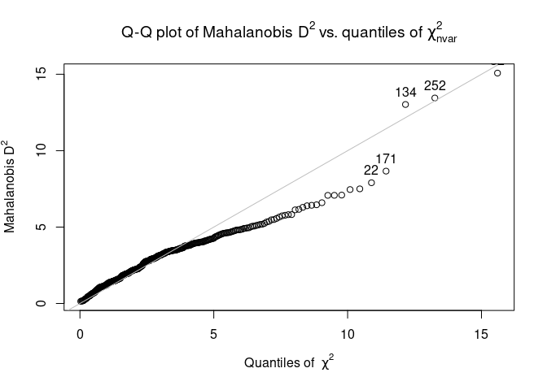

## Quality Assurance

QA is basically the same for all data analysis, regardless of what software 
package you are using. The fundamental idea of QA is to is to make sure that all
of the data in your dataset is roughly what you expect it to be. 
Below are some tips for doing this in R:


```r
library(region5air)
data(airdata)
```


### Data types

Use str() after importing your data to ensure that everything was imported in the 
expected format.


```r
str(chicago_air)
```

```
## 'data.frame':	365 obs. of  6 variables:
##  $ date   : chr  "2013-01-01" "2013-01-02" "2013-01-03" "2013-01-04" ...
##  $ ozone  : num  0.032 0.02 0.021 0.028 0.025 0.026 0.024 0.021 0.031 0.024 ...
##  $ temp   : num  17 15 28 18 26 36 25 30 41 33 ...
##  $ solar  : num  0.65 0.61 0.17 0.62 0.48 0.47 0.65 0.39 0.65 0.42 ...
##  $ month  : num  1 1 1 1 1 1 1 1 1 1 ...
##  $ weekday: num  3 4 5 6 7 1 2 3 4 5 ...
```

### "Illegal" Data

You can use R to replace "illegal" data, which is data that is not conceivably 
possible and has ended up in your dataset by accident. Below we replace any
negative ozone value with `NA`.

chicago_air$ozone[chicago_air$ozone < 0] <- NA

### Outliers

Handling outliers is difficult because we do not neccesarily want to remove data
that may be uncommon but within the realm of possibility. The best way to detect
this is to look at the summary of your data and pay attention to min and max values.
You can plot the data to see if you can detect anything weird through visual inspection.
Boxplots with outliers plotted as points are typically handy for this.


```r
boxplot(chicago_air$ozone)
```

<!-- -->

You can also do outlier tests on your dataset. 

Below, the `outlier()` function takes a `data.frame` of numeric columns and 
calculates the Mahalanobis distance distince which is a way of detecting outliers.
This is identifying multivariate records that appear to be unusual, and the farther
the point is away from the line in the graph, the more suspect the record is. The 
number on the graph is labeling the record by row (i.e. the day of the year).


```r
library(psych)

outliers <- outlier(chicago_air[, c("ozone", "temp", "solar")], plot=TRUE)
```

<!-- -->

### Missing Data

It's important to use the value `NA` in your dataset to represent missing data.
We don't want to retain missing data codes, such as -999. You might have several
codes that could represent a missing value, so you could use the method below
to replace your codes with `NA`s.


```r
missing_codes <- c(-99, -999)

my_temp <- c(81, 82, 75, 90, -99, 74, 76,-99, 68)
my_temp[my_temp %in% missing_codes] <- NA

my_temp
```

```
## [1] 81 82 75 90 NA 74 76 NA 68
```

Alternatively, when you read in a file with missing codes you can use the `na.strings`
argument in `read.csv()` or `read.table()`


```r
read.table(na.strings = c('-99','-999'), text = '
  1      5
  5      8
  3    -99
-99      3
  5      4
  9   -999
  7      6
  5      1
  9      3
-99      4
')
```

```
##    V1 V2
## 1   1  5
## 2   5  8
## 3   3 NA
## 4  NA  3
## 5   5  4
## 6   9 NA
## 7   7  6
## 8   5  1
## 9   9  3
## 10 NA  4
```
### Some options for NAs

The `zoo` package has some functions that help replace `NA` values with values
that might make sense, when you cannot have a missing value for your analysis.


```r
# install.packages("zoo")
library(zoo)
```

The `na.locf()` function replaces the `NA` with the most recent non-`NA` prior
to it.


```r
my_temp
```

```
## [1] 81 82 75 90 NA 74 76 NA 68
```

```r
na.locf(my_temp)  
```

```
## [1] 81 82 75 90 90 74 76 76 68
```

The `na.approx()` function replaces each `NA` with a linearly interpolated value.


```r
my_temp
```

```
## [1] 81 82 75 90 NA 74 76 NA 68
```

```r
na.approx(my_temp) 
```

```
## [1] 81 82 75 90 82 74 76 72 68
```

And the `na.spline()` function replaces each `NA` with a cubic spline interpolation.


```r
my_temp
```

```
## [1] 81 82 75 90 NA 74 76 NA 68
```

```r
round(na.spline(my_temp)) 
```

```
## [1] 81 82 75 90 86 74 76 77 68
```


### Other QA Issues

- Neglected due diligence for package (e.g. is author qualified to develop a stats package)
- Didn't read documentation and misused package or function
- Didn't check work appropriately, including tests when needed

It is worth learning how to use the [testthat package](https://testthat.r-lib.org/)
to set up automated testing to check for obvious errors, and avoid repeating errors
in the future.

## Common Pitfalls

- Although it may be outdated in some cases, [R Inferno](https://www.burns-stat.com/pages/Tutor/R_inferno.pdf)
is still great resource for dealing with common R errors.

- If you get a syntax error, then you've entered a command that R can’t understand.
Generally the error message is pretty good about pointing to the approximate point
in the command where the error is. Common syntax mistakes are missing commas, 
unmatched parentheses, and the wrong type of closing brace [for example, an 
opening square bracket but a closing parenthesis).

- Errors of the object-not-found variety can have one of several causes:
    - The name is not spelled correctly, or the capitalization is wrong
    - The package or file containing the object is not on the search list
